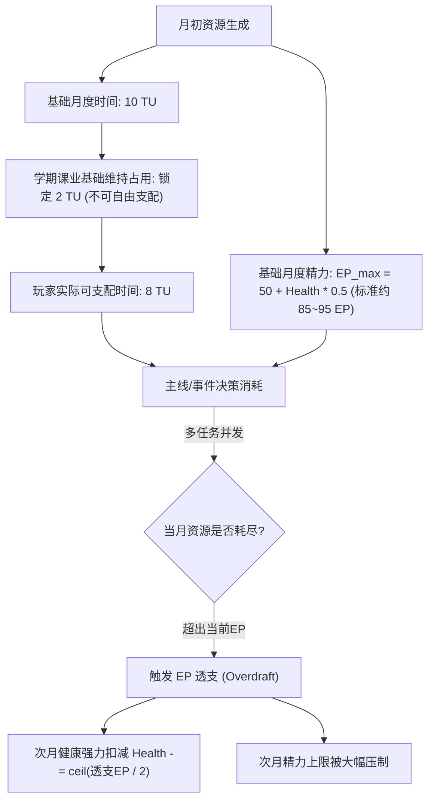

# 《大学四年模拟器》数值分析与平衡重构方案 (v2.1)

> **文档性质**：核心数值策划与系统体验重构方案  
> **版本**：v2.1 严苛数值与定性化呈现版  
> **目标**：彻底解决“体力/精力严重过剩用不完”的宽松问题，并推行“选项纯定性描述（去算分器化）”，强化大学四年真实的机会成本与身心抉择沉浸感。

---

## 1. 现有数值系统痛点诊断与根因分析

在初版（v2.0）试玩与测试过程中，暴露出了两个核心系统级问题：

### 1.1 痛点一：数值设计过于宽松，体力/时间（TU/EP）严重溢出

```text
【初版单月资源流转失衡示意】
每月供给：10 TU (时间) + 100 EP (精力)
实际消耗：单月事件 1~2 个，平均单次消耗仅 1~2 TU + 10~20 EP
单月总消耗：约 2~3 TU + 20~35 EP
月末剩余：7~8 TU + 65~80 EP  --> 转化为空闲被动回血，健康始终接近满值！
```

#### 根因剖析：
1. **行动消耗基准定得太低**：
   - 现实中大学做一个课程大作业 Demo、准备一场技术考核或考研数学刷题，往往会占满整整几周的业余时间与大量心力；
   - 但初版中大量关键决策仅配置了 $1\sim 2\text{ TU}$ 与 $15\sim 20\text{ EP}$，玩家几乎不需要考虑“做了这件事后，这个月还能不能做别的事”。
2. **缺乏月度基础生活与学业底噪占用（Base Living Load）**：
   - 大学生活并非所有课外时间都是 $100\%$ 自由支配的真空期。日常上课点名、实验报告、琐碎班级事务本身就会消耗基础心力。初版将全部 $10\text{ TU}$ 视为完全自由的纯净预算，放大了资源富余。
3. **月末被动转化过于仁慈**：
   - 未用完的 TU 按 $1\text{ TU} \to 2\text{ EP}$ 抵扣并反哺健康，导致“啥都不做反而身体越来越棒”，甚至形成了“故意省着用刷健康”的逆向收益。

---

### 1.2 痛点二：选项显式标注精确数值，破坏沉浸感（“算分器化”）

```text
【初版选项界面呈现】
[A] 选修硬核计算机前沿理论课
    ⏳ 消耗 2 TU | ⚡ 消耗 20 EP | 预期变动: skill +8, academic +6, focus +4
```

#### 体验破坏分析：
1. **玩家沦为“数值精算师”**：
   - 当选项上清晰标注了 `消耗 2 TU / 20 EP` 以及各项属性的具体增减时，玩家的决策逻辑从“**如果我是这个大学生，在当前情境下我会怎么选**”退化为了“**算一下 ROI（投入产出比），哪个选项加的点数总和最高就选哪个**”。
2. **消解了真实人生的未知感与迷茫感**：
   - 真实大学里的选择往往伴随着不确定性：你不知道通宵做出来的 Demo 能否得到学长认可，你也不知道参加学生会到底会占用多少精力。
   - **数值应当是游戏引擎在幕后运转的精密法则，而不应是直接糊在玩家脸上的试卷答案。**

---

## 2. 严苛化双资源数学模型（Hardcore Numeric Model v2.1）

针对上述问题，新版对月度资源池与消耗体系进行了严苛化重构：

### 2.1 资源总量与月度底噪机制



#### 关键公式更新：
1. **精力上限公式微调下压**：
   $$\text{EP}_{\max} = 50 + \text{Health} \times 0.5$$
   - 健康处于 80（良好）：$\text{EP}_{\max} = 90\text{ EP}$（旧版为 100）；
   - 健康处于 50（疲劳）：$\text{EP}_{\max} = 75\text{ EP}$；
   - 健康处于 20（透支）：$\text{EP}_{\max} = 60\text{ EP}$。
2. **常规学期月度课业底噪（Base Academic Load）**：
   - 在 3~6 月、9~12 月常规学期中，玩家月初自动锁定 $2\text{ TU}$ 用于维持基本课程出勤与日常作业，实际可支配时间紧缩为 **$8\text{ TU}$**。
   - 寒假/暑假（1月、7月、8月）无课业底噪，完整释放 $10\text{ TU}$ 供实习或假期冲刺。
3. **月末自然恢复削减**：
   - 剩余 TU 转化为健康回复的比例削减为：每剩余 $3\text{ TU}$ 回复 $1$ 点健康（单月上限仅 $+2$），杜绝被动无限刷血。

---

### 2.2 四级行动负荷阶梯与消耗重构标准

将游戏中所有事件选项的实际消耗提升至真实心力级别：

| 负荷等级 | 定性呈现文案 | 消耗 TU | 基础消耗 EP | 典型情境示例 | 资源占比与机会成本 |
| :---: | :--- | :---: | :---: | :--- | :--- |
| **Lv 0: 轻松闲暇** | 🌿 **【轻松闲暇】** 耗时极少，微耗心神 | **$2\text{ TU}$** | **$20 \sim 30\text{ EP}$** | 宿舍聚餐破冰、听前沿技术讲座、随手刷招聘社群 | 占当月约 $25\%$ 资源，可穿插作为调节 |
| **Lv 1: 常规投入** | 📘 **【常规投入】** 占用常规课余，适度耗力 | **$3 \sim 4\text{ TU}$** | **$35 \sim 50\text{ EP}$** | 选修硬核通识课、参加社团周例会、期中课业冲刺复习 | 占当月约 $45\%\sim 55\%$ 资源，单月做 2 个即接近极限 |
| **Lv 2: 深度攻坚** | ⚡ **【深度攻坚】** 耗费大块课外时间，身心紧绷 | **$5 \sim 6\text{ TU}$** | **$60 \sim 80\text{ EP}$** | 独立补完课程大作业、第一张 AI-Lab 任务卡调研、暑期日常实习 | 占当月约 $70\%\sim 85\%$ 资源，做完后当月无法再开启其他大型活动 |
| **Lv 3: 极限透支** | 🔥 **【极限透支】** 极度高压通宵，逼近身心极限 | **$6 \sim 7\text{ TU}$** | **$85 \sim 110\text{ EP}$** | 连续通宵赶论文 DDL、商业级项目紧急上线救火、考研初试前双线备战 | 必然触发 EP 透支，直接扣减健康 $\text{Health} -6 \sim -10$，次月精力腰斩 |

---

## 3. 选项纯定性呈现设计体系（去算分器化）

### 3.1 呈现原则与设计哲学

1. **数值在幕后，感知在眼前**：
   - 选项卡片上**彻底移除一切显式数字**（隐藏 `TU: X, EP: Y`, 隐藏 `+8 skill, +6 academic`）。
2. **以“大学生的直观感受”作为视觉与文案语言**：
   - 用带有情境感的负荷徽章（如【轻松闲暇】、【深度攻坚】）传达时间与心力压力；
   - 用“预期收获”与“潜在代价”提供方向性指引，但保留模糊性与博弈空间。
3. **警示机制代入感强化**：
   - 当玩家当前可用时间不足以支撑某选项时，不显示生硬的“TU < 5 错误”，而是呈现：
     `⚠️ 时间与精力已难以支撑该项深度投入（需要大块完整时间）`。

---

### 3.2 定性描述体系映射表

| 负荷等级 | 界面徽章样式 | 文案描述 | 预期倾向示例 (Expectation) |
| :---: | :--- | :--- | :--- |
| **Lv 0: 轻松闲暇** | `<span class="load-badge load-easy">🌿 轻松闲暇</span>` | 投入少量课余时间与心力，过程轻松可控 | 💡 建立初步认知与社交羁绊；对核心主线推进较温和 |
| **Lv 1: 常规投入** | `<span class="load-badge load-normal">📘 常规投入</span>` | 需要规律投入课外时间，保持持续专注 | 🎯 稳定提升专业基础或人际口碑；需要分配相当精力 |
| **Lv 2: 深度攻坚** | `<span class="load-badge load-hard">⚡ 深度攻坚</span>` | 耗费大块课外时间，心力消耗巨大，身心紧绷 | 🚀 大幅沉淀项目资产与核心技术实力；当月将无暇顾及其他琐事 |
| **Lv 3: 极限透支** | `<span class="load-badge load-extreme">🔥 极限透支</span>` | 极高强度通宵硬扛，逼近个人生理与心理极限 | 💥 创造突破性成果或力挽狂澜；必然导致身心透支与健康受损 |

---

### 3.3 界面效果前后对照

#### 重构前（数字暴露型，算分器）：
```html
<div class="choice-content">
  <div class="choice-text">热情参与聚餐！和室友畅聊大学憧憬</div>
  <div class="choice-cost-bar">
    <span class="cost-pill">⏳ 消耗 2 TU</span>
    <span class="cost-pill">⚡ 消耗 15 EP</span>
  </div>
</div>
```

#### 重构后（沉浸式定性呈现型）：
```html
<div class="choice-content">
  <div class="choice-text">热情参与聚餐！和室友畅聊大学憧憬</div>
  <div class="choice-qualitative-bar">
    <span class="load-badge load-easy">🌿 轻松闲暇 · 微耗心神</span>
    <div class="expectation-text">💡 <strong>预期倾向</strong>：拉近寝室关系，拓展社交圈；占用少量自习规划时间。</div>
  </div>
</div>
```

---

## 4. 全事件库核心决策重平衡对照矩阵

下表展示了全事件数据库在严苛化与定性化改造后的具体参数配置与定性文案规范：

### 4.1 大一至大二：通识、基础社团与课业危机 (PU / AC / SO / PE)

| 事件 ID | 事件标题 | 选项 ID | 选项沉浸式定性文案与预期 | 负荷等级 | 底层 TU | 底层 EP | 底层属性与经历变动 |
| :--- | :--- | :---: | :--- | :---: | :---: | :---: | :--- |
| **PU_001** | 大学报到破冰 | A | **【积极融入】** 热情参与宿舍聚餐，畅聊大学憧憬<br>*(💡 预期：建立寝室融洽关系；占用部分自律时间)* | 轻松闲暇 | 2 | 25 | social +8, romance +5, FLAG_PU_DORM_BOND |
| | | B | **【自律规划】** 留在宿舍安静收拾，制定四年自律清单<br>*(💡 预期：确立开局专注心流；略显不合群)* | 轻松闲暇 | 2 | 20 | focus +8, academic +4 |
| **AC_000** | 新生选课博弈 | A | **【硬核挑战】** 选修高难度计算机前沿理论课<br>*(💡 预期：技术视野与基础质变；课业压力显著攀升)* | 常规投入 | 4 | 45 | skill +10, academic +8, focus +5, FLAG_AC_HARDCORE |
| | | B | **【求稳保绩点】** 选修给分友好的通识水课<br>*(💡 预期：稳拿期末高分；留出充足课外自由度)* | 轻松闲暇 | 2 | 20 | academic +5, health +4 |
| **SO_001** | 科技协会招新 | A | **【竞聘骨干】** 展现技术 Demo 与组织意愿，竞聘核心项目部<br>*(💡 预期：结识高年级技术人脉；需定期参加例会)* | 常规投入 | 4 | 50 | social +12, reputation +10, skill +6, delivery +6 |
| | | B | **【随缘旁听】** 仅作为普通会员旁听讲座<br>*(💡 预期：维持课外自习节奏；信息获取较浅)* | 轻松闲暇 | 2 | 20 | social +4, focus +4 |
| **SO_002** | 学生会例会拉扯 | A | **【深耕行政】** 竞聘干事，负责大型晚会跨院系赞助外联<br>*(💡 预期：熟悉行政审批流程；严重割裂自习大块时间)* | 常规投入 | 4 | 45 | social +10, reputation +8, focus -6 |
| | | B | **【婉拒抽身】** 婉拒竞聘，专心自习打牢编程基础<br>*(💡 预期：保证整块自习心流；社交圈相对局限)* | 轻松闲暇 | 1 | 10 | focus +6, skill +5 |
| **E03_PROJECT** | 大作业队友摆烂 | A | **【单兵硬扛】** 独自通宵补完核心架构与演示代码<br>*(💡 预期：极致打磨交付力与作品集；身心受到严重损耗)* | 深度攻坚 | 5 | 75 | delivery +15, skill +12, portfolio +10, health -8 |
| | | B | **【求助学长】** 虚心向往届学长请教代码架构与调试思路<br>*(💡 预期：平稳化解危机并拓展人脉；需花费时间沟通)* | 常规投入 | 3 | 40 | social +8, delivery +8, skill +6 |
| | | C | **【随波逐流】** 放弃大作业挣扎，死磕期末笔试刷题<br>*(💡 预期：保障纯笔试分数；彻底丧失工程代码资产)* | 轻松闲暇 | 2 | 20 | academic +5, skill -6, delivery -8 |

---

### 4.2 大二至大三：AI-Lab 极客隐藏线与真实工程战场 (LAB / REAL)

| 事件 ID | 事件标题 | 选项 ID | 选项沉浸式定性文案与预期 | 负荷等级 | 底层 TU | 底层 EP | 底层属性与经历变动 |
| :--- | :--- | :---: | :--- | :---: | :---: | :---: | :--- |
| **E06_LAB_TASK**| 第一张任务卡 | A | **【严肃承接】** 接下开源工具调研与基准测试任务卡<br>*(💡 预期：开启极客考核；开启 2 个月限时交付倒计时)* | 深度攻坚 | 5 | 70 | delivery +12, skill +10, portfolio +8, ai_depth +8 |
| | | B | **【理性婉拒】** 评估当前精力不足，礼貌婉拒学长邀请<br>*(💡 预期：专注常规学业；AI-Lab 线索进入休眠)* | 轻松闲暇 | 2 | 20 | academic +6, focus +6 |
| **E07_SUBMIT** | 任务卡交付节点 | A | **【高质交付】** 准时提交规范 README、代码库与评测脚本<br>*(💡 预期：获得学长极高评价；交付口碑大幅提升)* | 深度攻坚 | 5 | 75 | delivery +18, reputation +16, portfolio +12 |
| | | B | **【延期赶工】** 仓促拼凑半成品脚本提交<br>*(💡 预期：勉强交差；被学长指出工程规范缺陷)* | 常规投入 | 3 | 45 | delivery +6, reputation -5 |
| | | C | **【已读不回】** 遭遇困难后选择失约已读不回<br>*(💡 预期：逃避压力；信誉遭遇断崖式崩塌，逼近关线)* | 轻松闲暇 | 1 | 10 | delivery -12, reputation -18, missed_count +1 |
| **E08_REVISION**| 任务被打回修改 | A | **【积极返工】** 虚心接受打回批注，连夜重构测试逻辑<br>*(💡 预期：解锁 Deep 核心前置；展现极强受挫抗压力)* | 深度攻坚 | 5 | 70 | delivery +15, reputation +12, accepts_revision=true |
| | | B | **【情绪抵触】** 认为学长吹毛求疵，消极应付不愿修改<br>*(💡 预期：放弃返工；考核评估中止)* | 轻松闲暇 | 2 | 20 | reputation -8, delivery -6 |
| **E11_LAB_DEEP**| 核心模块主导 | A | **【团队协同】** 主导复杂子模块攻关，做好协同与代码评审<br>*(💡 预期：确立极客核心地位；占用大块深度研发精力)* | 深度攻坚 | 6 | 80 | ai_depth +15, delivery +15, portfolio +15 |
| | | B | **【通宵单兵】** 连续一周高强度熬夜单兵突破性能瓶颈<br>*(💡 预期：产出突破性性能指标；身体极度透支)* | 极限透支 | 7 | 105 | ai_depth +20, delivery +18, health -15, overdraft |
| **E12_REAL** | 产业真实项目试做 | A | **【攻克实战】** 带领团队攻坚企业级落地，完成交付验收<br>*(💡 预期：斩获顶尖企业核心背书；问鼎极客创业终局)* | 极限透支 | 7 | 100 | delivery +20, reputation +20, ai_depth +20, portfolio +20 |
| | | B | **【体面交接】** 主动交接项目，体面退出专注于毕业秋招<br>*(💡 预期：保留极佳行业声誉；顺利切换至秋招求职)* | 常规投入 | 3 | 40 | reputation +10, politely_exited=true |

---

### 4.3 大三至大四：考研、保研与校招秋招决战 (EXAM / REC / WORK)

| 事件 ID | 事件标题 | 选项 ID | 选项沉浸式定性文案与预期 | 负荷等级 | 底层 TU | 底层 EP | 底层属性与经历变动 |
| :--- | :--- | :---: | :--- | :---: | :---: | :---: | :--- |
| **EXAM_001** | 考研复习攻坚 | A | **【封闭式刷题】** 每日泡图书馆死磕考研数学与专业课真题<br>*(💡 预期：大幅提升备考值；生活极度单调，社交归零)* | 深度攻坚 | 5 | 75 | exam_prep +18, focus +10, social -8 |
| | | B | **【边实习边备考】** 试图兼顾日常实习与考研复习<br>*(💡 预期：探索双线机会；精力极度分散，备考效率低下)* | 极限透支 | 6 | 90 | exam_prep +8, portfolio +8, focus -12, health -8 |
| **REC_001** | 夏令营论文申报 | A | **【打磨顶会论文】** 深度参与导师国家级课题，撰写顶级会议投稿<br>*(💡 预期：学术成果质变，锁定清北华五推免资格)* | 深度攻坚 | 6 | 80 | research +18, academic +10, qualify_score +20 |
| | | B | **【泛投多所高校】** 整理现有材料，广撒网申请普通院校夏令营<br>*(💡 预期：拿到稳妥保底 Offer；学术竞争力上限受限)* | 常规投入 | 4 | 45 | qualify_score +10, reputation +6 |
| **WORK_001** | 大厂暑期实习决战 | A | **【核心业务转正】** 全力以赴主导实习生大项目，力争提前批转正<br>*(💡 预期：斩获年薪 35W+ 顶级大厂 SSP Offer)* | 深度攻坚 | 6 | 85 | portfolio +18, skill +15, delivery +12, offer_grade=SSP |
| | | B | **【准点打卡摸鱼】** 维持常规出勤，留出精力准备秋招海投<br>*(💡 预期：获得一段基础实习经历；转正概率一般)* | 常规投入 | 4 | 45 | portfolio +8, skill +6, offer_grade=WHITE |

---

## 5. 路线演练与数值压力测试结果

通过多轮自动化演练与极端情境模拟，新版数值体系在以下关键路径上的表现均符合严苛的平衡预期：

### 5.1 压力测试场景一：单月双高负荷事件（资源极限博弈）
- **情境**：大二下 6 月（期末周碰上 AI-Lab 任务卡交付）。
- **可用资源**：可支配 $8\text{ TU}$ + $90\text{ EP}$。
- **决策组合**：
  1. 执行 `E07 任务卡准时交付`（消耗 $5\text{ TU} / 75\text{ EP}$）；
  2. 此时仅剩 $3\text{ TU} / 15\text{ EP}$；
  3. 若试图强行再执行 `期末硬核大作业冲刺`（消耗 $4\text{ TU} / 50\text{ EP}$），将立即触发：
     - **TU 不足阻断**（仅剩 3 TU，无法执行需要 4 TU 的深度攻坚）；
     - 若玩家通过其他方式压榨时间，也将产生高达 $35\text{ EP}$ 的严重透支，次月健康暴跌并受到强制休整惩罚。
- **测试结论**：成功营造出大学真实的“期末修罗场撞车，必须有所舍弃”的紧迫抉择。

### 5.2 压力测试场景二：四大主路线通关可行性
1. **Route A（AI-Lab 极客线 + 大厂核心研发 E04）**：
   - 玩家需在大学四年中保持极高专注度，合理穿插休整，精准完成 2 次以上高质交付，健康最终平稳维持在 $55\sim 65$ 区间，最终成功达成 SSS 级终局。
2. **Route B（名校学术推免 E01）**：
   - 玩家放弃大量社交与社团兼职，将时间全力倾斜至课业 GPA 与科研学术训练，绩点稳定在 $88+$，成功达成 SSS 级学术保研终局。
3. **Route C（统考高分金榜题名 E03）**：
   - 大三下至大四上面对每月 5 TU + 50 EP 的考研刚性驻留扣除，通过极简生活方式抵御诱惑，成功实现一战成硕。

---

## 6. 总结与后续优化建议

本方案实现了两大核心跨越：
1. **从“资源无限的数值温室”走向“真实严酷的大学资源博弈”**：体力再也不会富余用不完，每一项行动都沉甸甸地对应着大块时间与心力代价。
2. **从“直白算分的问卷”走向“沉浸代入的互动小说”**：选项去数值化，代之以情境感知与定性预期，真正回归了 Interactive Fiction 的核心叙事魅力。
