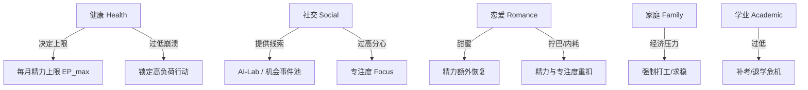

# 06_基础状态定义表

> **版本**：v1.0  
> **责任人**：2号（状态、资源与数值平衡）  
> **适用范围**：全游戏数值系统基础标尺，供 1号（流程/逻辑）、3号（事件制作）、4号（路线设计）统一读取与调用。  
> **核心原则**：统一标尺（0—100分制）、明确区间意义、提供软硬门槛、杜绝无意义数值膨胀。

---

## 1. 基础状态系统概述

本模拟器采用 **“五大核心生存/生活状态 + 七大能力沉淀变量”** 的分层设计：
1. **五大基础生活状态**：学业、社交、恋爱、家庭、健康。这五项代表玩家大学期间的日常生活平衡与心理/生理承受力，是每个月必须结算并维系的基础生存面。
2. **状态统一标尺**：所有状态严格标准化在 $[0, 100]$ 的闭区间整数内。
3. **分层状态区间**：所有系统及事件触发条件优先采用统一状态区间（如“健康处于【偏低】”），而非散乱的硬编码（如“健康 < 37”）。

```text
  [0 ── 20]      [21 ── 40]      [41 ── 60]      [61 ── 80]      [81 ── 100]
  严重不足/危机      偏低/受限        正常/平稳        良好/优势       拔尖/卓越
```

---

## 2. 五大基础状态详细定义

### 2.1 学业（Academic / GPA）

* **核心含义**：专业课成绩、绩点（GPA）转化分、学术基础扎实度与考试应对能力。
* **数值范围**：$0 \sim 100$
* **初始值原则**：大一入学默认基准为 **$50 \sim 60$**（反映普通高考考生的基础水平，根据开局背景略有浮动）。
* **自然衰减与维护机制**：
  * 大学课程具有“遗忘与难度递增”特性。每个学期末（**大一上12月、大一下6月、大二上12月、大二下6月、大三上12月、大三下6月、大四上12月、大四下6月**），若该学期内投入学业事件少于 2 次，学业自然衰减 **$-5$** 点。
  * *保研路线免衰减豁免*：处于保研【进行中】且正常支付月度驻留成本的月份，其消耗已包含顶尖绩点课外维持，**自动计入当学期学业投入计数**，无需重复执行 Lv 1。
  * *AI-Lab 修正*：AI-Lab 处于 `ACTIVE` / `DEVELOPED` 阶段时，该学期的免衰减门槛由 2 次提升至 **3 次**（深度项目会真实挤占课业精力，见 `09` §5）。
* **五层区间定义**：

| 区间 | 状态等级 | 现实对应表现 | 游戏机制影响 |
| :--- | :--- | :--- | :--- |
| **0 — 20** | **严重不足** | 多门核心课挂科、面临学业警告/留级危机 | 强制触发【学业危机/补考】事件；锁定所有推免与高质量实习；无法选择 AI-Lab 深度任务 |
| **21 — 40** | **偏低** | 绩点在 $2.0 \sim 2.6$ 边缘，勉强及格，理解吃力 | 阻止进入【保研-潜在】状态；期末考试有较大挂科概率（$30\%$）；面试易被刷 |
| **41 — 60** | **正常** | 绩点在 $2.7 \sim 3.2$，中规中矩，无挂科风险 | 满足正常毕业、常规校招投递基本门槛；可作为考研的基准储备 |
| **61 — 80** | **良好** | 绩点在 $3.3 \sim 3.7$，专业前 $20\%$，基础扎实 | 满足【考研学术储备】、【优质外企/大厂实习】门槛；保研处于边缘竞争区 |
| **81 — 100** | **卓越** | 绩点 $\ge 3.8$，专业前 $5\%$，国奖/一等奖学金有力争夺者 | 满足【保研-直接提名】核心条件；学术导师好感度默认提高；秋招研发岗通过简历关 |

* **允许单次变化范围**（直接引用 `08` 的 Tier 等级）：

| 情境 | 等级 | 标签写法 |
| :--- | :---: | :--- |
| 普通事件（读一章书、做一次作业） | Tier 1 — Tier 2 | `学业[微幅提升]` / `学业[一般提升]` |
| 期中 / 大作业 / 任务卡交付 | Tier 3 | `学业[明显提升]`（可加 `·弱` / `·强`） |
| 期末考试 / 重修 / 重大竞赛结算 | Tier 4 | `学业[重大提升]` / `学业[重大下降]` |

---

### 2.2 社交（Social / Connection）

* **核心含义**：人脉网络密度、信息获取敏锐度、同伴圈层质量、与学长/老师的连接度。
* **数值范围**：$0 \sim 100$
* **初始值原则**：大一入学默认基准为 **$30 \sim 45$**（小县城/普通新生，略带内敛，缺乏一手大学信息源）。
* **自然衰减与维护机制**：
  * 社交网络具有“疏离效应”。连续 3 个月未参与任何社交/社团/交流事件，社交值自然衰减 **$-3$** 点。
* **五层区间定义**：

| 区间 | 状态等级 | 现实对应表现 | 游戏机制影响 |
| :--- | :--- | :--- | :--- |
| **0 — 20** | **严重不足** | 极度孤立、严重信息闭塞，不认识任何学长或行业人士 | 无法获取任何【信息差/内推/组队】机会；大创/竞赛无法组队；极易踩坑（如不知道保研规则） |
| **21 — 40** | **偏低** | 仅限于宿舍或极小圈子交流，被动接受二手信息 | 组队只能随机匹配到摸鱼队友；社团/实验室招新面试通过率受限 |
| **41 — 60** | **正常** | 有稳定好友圈，能正常获取年级群与官方通告信息 | 满足常规团队项目组队需求；能正常参与社团日常活动 |
| **61 — 80** | **良好** | 认识靠谱学长学姐、社团技术骨干，信息灵通 | 优先触发【二手信息差提前知晓】、【竞赛大佬带队】、【AI-Lab浅层线索】 |
| **81 — 100** | **卓越** | 核心人脉节点、学生骨干或技术圈KOL，口碑在外 | 获得【稀缺内部名额】、【导师引荐】、【创业团队直接邀请】；组队时具备强大号召力 |

* **允许单次变化范围**（引用 `08` Tier）：

| 情境 | 等级 |
| :--- | :---: |
| 朋友圈点赞、寝室闲聊、一次课间搭话 | Tier 1 |
| 社团例会、与学长深聊半小时、一次聚餐 | Tier 2 |
| 社团招新面试通过、加入核心技术圈子、主办院系活动 | Tier 3 |
| 核心组织选举成功 / 大型活动主办 / 重要关系彻底破裂 | Tier 4 |

### 2.3 恋爱（Relationship / Romance）

* **核心含义**：亲密关系状态、情感羁绊与情绪稳定性（单身渴望、暧昧心动、热恋甜蜜、矛盾摩擦、异地消耗）。
* **数值范围**：$0 \sim 100$
* **初始值原则**：大一入学默认基准为 **$25 \sim 35$**（单身探索状态，无情感包袱，完全落在平稳单身区间内）。
* **【重要】恋爱是全系统唯一的非单调轴**：
  * 恋爱值衡量的是 **情感投入度与情绪饱满度**，**不是**「情感质量」——数值高 $\ne$ 状态好。
  * $30$（健康单身）优于 $50$（暧昧期，开始消耗时间）在某些策略下是成立的；$88$（深度绑定）会在大四带来毕业去向强约束。
  * 因此 **3号 撰写恋爱事件时必须使用 `08` §7.2 的专用标签**（`恋爱[明显升温]` 等），**禁止**使用 `恋爱[明显提升]` 这类单调标签。引擎会对误用报错。
* **动态特性**：
  * 处于单身状态时，数值稳定在 $25 \sim 38$。
  * 进入暧昧/恋爱后，数值会随着互动急剧波动。
* **五层区间定义**：

| 区间 | 状态等级 | 现实对应表现 | 游戏机制影响 |
| :--- | :--- | :--- | :--- |
| **0 — 20** | **严重不足** | 严重失恋、情感内耗、爱而不得、极度拧巴痛苦 | 带来负面心理减益：每月基础精力 $-15$、专注度 Focus $-20$；持续 2 个月可能引发轻度抑郁 |
| **21 — 40** | **平稳单身** | 独善其身、心无旁骛，或处于健康的情感空窗期 | 无情绪内耗，时间与精力全额保留用于学业与技术成长 |
| **41 — 60** | **萌芽/试探** | 存在心仪对象、处于暧昧期或初期磨合 | 每月固定消耗 **$1\text{ TU}$** 维护；伴随随机情绪波动（$\pm 5$ 浮动） |
| **61 — 80** | **甜蜜稳定** | 互相扶持、作息同步、情绪正向反馈 | 每月固定占用 **$1\text{ TU}$**；提供正面精力加成（每月精力恢复 $+10$）；抗压能力上升；允许情侣共同自习复用学业维持 |
| **81 — 100** | **深度羁绊** | 灵魂伴侣、深度绑定人生规划 | 每月固定占用 **$1\text{ TU}$**；极大提高抗焦虑能力；但在大四毕业去向时产生强约束（异地/考研择校必须一致，否则剧烈扣分） |

* **允许单次变化范围**（引用 `08` §7.2 恋爱专用标签）：

| 情境 | 等级 | 标签 |
| :--- | :---: | :--- |
| 日常聊天、互道晚安 | Tier 1 | `恋爱[微幅升温/降温]` |
| 一起在食堂吃饭、散步自习、一次小争执 | Tier 2 | `恋爱[一般升温/降温]` |
| 告白成功、纪念日、严重冷战 | Tier 3 | `恋爱[明显升温/降温]` |
| 分手、异地决裂、确立共同人生规划 | Tier 4 | `恋爱[重大升温/降温]` |

* **量化定义（供 `09` 与 3号 引用）**：
  * **`恋爱严重内耗`** $\equiv$ 恋爱 $\le 20$（即区间宏 `CRITICAL_LOW`），`09` 统一使用 `恋爱 > 20`。

---

### 2.4 家庭（Family / Support）

* **核心含义**：家庭对个人选择的理解支持度、经济包容度与精神托底程度（高值代表充分尊重与经济宽裕，低值代表经济拮据、催促考公/考研/就业的沉重压力）。
* **数值范围**：$0 \sim 100$
* **初始值原则**：大一入学默认基准为 **$50 \sim 60$**（普通工薪家庭，对体制内/考研有传统期待，提供常规生活费）。
* **五层区间定义**：

| 区间 | 状态等级 | 现实对应表现 | 游戏机制影响 |
| :--- | :--- | :--- | :--- |
| **0 — 20** | **极度施压/经济危机** | 家庭经济断供、强烈催促立刻退学打工或必须回老家考公 | **每月强制占用 $2\text{ TU}$ 兼职赚钱**（不可跳过）；锁定考研路线【进行中】；无薪实习/试做类机会全部关闭；每累计兼职 2 个月触发一次家庭理解事件（家庭 $+5$），形成脱困闭环 |
| **21 — 40** | **催促紧绷** | 观念严重代沟，父母频繁说教“考公/体制内才是唯一出路” | **每月强制占用 $1\text{ TU}$ 兼职**；每月精力上限 $-10$；选择非体制路线时频繁触发家庭争吵事件；兼职可带来经济自立并缓慢回升家庭支持度 |
| **41 — 60** | **常规理解** | 父母提供常规生活费，虽有唠叨但尊重孩子基本决策 | 无强制占用；满足常规考研、校招求职所需的基本生活托底支持 |
| **61 — 80** | **包容支持** | 家庭经济较好，愿意为子女试错提供资金 | 解锁 **考研二战** 分支；解锁 **一线城市租房求职**（否则秋招限本地岗位）；允许接受短期无回报的技术攻关 |
| **81 — 100** | **强力后盾** | 精神与经济完全托底，全力支持子女自由探索 | 完全免除经济压力事件；**真实战场线的无薪试做期不受经济压制**；解锁 **慢就业/间隔年** 收口而不触发家庭危机 |

* **允许单次变化范围**（引用 `08` Tier）：

| 情境 | 等级 |
| :--- | :---: |
| 每月通话报平安、生活费发放 | Tier 1 |
| 父母寄特产、假期愉快相处、一次小口角 | Tier 2 |
| 假期深度沟通、父母全力支持某项投入、因择校发生争执 | Tier 3 |
| 做出违背家庭意愿的重大决定 / 父母大病 / 家庭经济危机 | Tier 4 |

---

### 2.5 健康（Health / Vitality）

* **核心含义**：生理体能储备、作息规律度、心理韧性与抗压防线。
* **数值范围**：$0 \sim 100$
* **初始值原则**：大一入学默认基准为 **$75 \sim 85$**（年轻人充沛的身心状态）。
* **与行动资源的直接锚定**：
  * **健康直接决定每月的精力上限**：$$EP_{max} = 60 + \text{Health} \times 0.5$$
  * 健康的真正硬约束由 **`07` §2.3 的「健康行动封锁表」** 兑现（TU 上限 + 可执行行动等级上限），杜绝“以命换分”无脑刷属性。
* **五层区间定义**：

| 区间 | 状态等级 | 现实对应表现 | 游戏机制影响（以 `07` §2.3 行动封锁表为准） |
| :--- | :--- | :--- | :--- |
| **0 — 20** | **身心崩溃/重病** | 严重失眠、躯体化反应、重度疲劳综合征或重病住院 | **当月 TU 上限压至 $3$**（专用于休整），只能执行 Lv 0 与休整类 Lv R；强制触发 `CRISIS_BURNOUT_01`；当期限时任务全部判失约 |
| **21 — 40** | **亚健康/透支** | 长期熬夜、免疫力低下、注意力涣散、日常焦虑 | TU 上限 $8$；**最高只能执行 Lv 2**（禁止 Lv 3 / Lv 4）；Lv 2 额外 $+30\%$ EP 消耗 |
| **41 — 60** | **普通疲劳** | 缺乏锻炼、偶尔熬夜，但无重大病痛 | TU 上限 $10$；最高 Lv 3（禁止 Lv 4）；Lv 3 额外 $+15\%$ EP 消耗 |
| **61 — 80** | **良好充沛** | 作息较规律，精神饱满，具备抗压韧性 | TU 上限 $10$；可执行全部等级；可平稳支撑多线任务 |
| **81 — 100** | **身心卓越** | 规律运动、精力极其旺盛、心态坚韧如铁 | TU 上限 $10$；Lv 4 的健康扣减减半（$-3 \sim -5$）；抗焦虑免疫 |

* **允许单次变化范围**（引用 `08` Tier）：

| 情境 | 等级 |
| :--- | :---: |
| 晨跑、早睡一晚、少刷半小时手机 | Tier 1 |
| 坚持一周早睡、单次熬夜到凌晨两点 | Tier 2 |
| 连续一周高强度熬夜赶 DDL、长假深度疗休养 | Tier 3 |
| 突发急性疾病住院、重度焦虑神经衰弱、彻底疗休养 | Tier 4 |

* **恢复通道**：健康的**主动恢复**必须通过 `07` §4.1 的休整行动（Lv R1 / R2 / R3）实现，被动恢复见 `07` §4.2。**单月健康恢复总量上限 $+15$**，防止“崩溃—疗养—再崩溃”的无损循环刷分。

---

## 3. 七大能力与成长沉淀变量（二级资产）

为了支撑 4号的进阶路线（工作、考研、保研、AI-Lab、真实战场）以及 1号的简历系统，2号定义以下 **7 项**沉淀能力资产：

| 中文名 | 英文名 | 引擎字段名 | 范围 | 初始值 | 核心含义与作用 | 提升与恢复途径 |
| :--- | :--- | :--- | :---: | :---: | :--- | :--- |
| **作品集** | Portfolio | `portfolio` | $0 \sim 100$ | $0$ | 真实可展示的代码库、Demo、上线产品等硬资产。 | 交付大作业、完成 AI-Lab 任务卡、参加真实项目 |
| **科研** | Research | `research` | $0 \sim 100$ | $0$ | 学术训练强度、论文意识、实验能力、与导师的学术连接。 | 联系导师、读论文、跑实验、组会汇报、投稿 |
| **硬技能** | Skill | `skill` | $0 \sim 100$ | $10$ | 编程、深度学习、前后端、Linux 系统指令、实验调参等核心硬实力。 | 自学、打代码、装双系统、完成技术攻关 |
| **交付力** | Delivery | `delivery` | $0 \sim 100$ | $20$ | 按时交差、不画饼、闭环解决问题、文档规范的职业化交付素质。 | 承诺后准时提交、接受修改反馈、完成项目复盘 |
| **声誉** | Reputation | `reputation` | $0 \sim 100$ | $30$ | 老师、学长、同行对你“靠谱、诚信、不失约”的评价口碑。 | 团队项目不甩锅、高质量结项、按时赴约；**受损后可通过主动承担补救任务/公开复盘（Lv 2/Lv 3）修复 $+8\sim 10$** |
| **专注度** | Focus | `focus` | $0 \sim 100$ | $50$ | 深度工作能力、抗外界杂音干扰、长期主义定力。 | 拒绝无效社交、单线深潜学习、拒绝三心二意 |
| **AI深度** | AI-Depth | `ai_depth` | $0 \sim 100$ | $0$ | 对前沿生成式 AI、大模型 Agent、RAG、扩散模型等的理解与实战深度。 | 探索前沿工具、加入 AI-Lab、跑开源模型、复现论文 |

> **变量收敛与维护机制说明**：
> * **能力资产轻度折旧机制（防止前期囤分后期弃管）**：硬技能 `skill` 与 AI深度 `ai_depth` 若**连续 2 个学期（12个月）** 完全未参与任何相关实战、课程或项目事件，学期末发生一次 Tier 1 微幅衰减 **$-2$** 点（模拟技术手生），促使玩家在后期保持基本的敏锐度。
> * **「科研 (Research)」**：支撑保研与学术型深造路线的核心资产，对齐上游任务书定义。
> * **「竞赛」不单独设数值变量**：竞赛成果统一映射到 `portfolio`（作品产出）+ `reputation`（获奖口碑），`09` 中所有门槛统一使用组合条件。
> * **上游《任务书》「实习 (Internship)」变量的处理**：上游任务书将 `Internship` 列为核心变量，在 2号体系中，实习不作为孤立的连续数值字段，而是由 **`portfolio`（实习项目产出）**、**`delivery`（职场交付素质）** 以及 **1号 简历经历池（ResumeEntry）中的【实习/工作经历】条目**与路线局部变量 **`resume_sent`** 共同承载。3号 编写实习事件时，请修改 `portfolio`、`delivery` 或 `reputation`，无需寻找单独的数值字段。
> * **字段名统一小写下划线**（`ai_depth` 而非 `AI-Depth`），全套文档以本表为准。

> ⚠️ **待 1号 确认**：《工作约束与固定产出规范》§1 规定 2/3/4 号不得自行修改「玩家状态一级结构」。
> 本节的 7 项能力资产属于对 1号 `02_玩家状态总结构` 的扩展，需要 1号 确认它们挂在玩家状态的哪一类下
> （建议新增一类「能力沉淀」，与「基础生活状态」并列）。

---

## 3.5 派生量定义（实时计算 · 不占用新的状态字段）

为避免继续扩大玩家状态结构，以下判定条件全部定义为 **由已有状态实时派生**，引擎不需要额外存储：

| 派生量 | 计算方式 | 说明 |
| :--- | :--- | :--- |
| **专业排名百分位** | 学业 $\ge 88 \Rightarrow$ 前 $5\%$；$\ge 82 \Rightarrow$ 前 $10\%$；$\ge 75 \Rightarrow$ 前 $20\%$；$\ge 60 \Rightarrow$ 前 $50\%$；否则后 $50\%$ | 学业分即分位映射，不引入独立排名系统 |
| **`flag_gpa_top_10`** | 学业 $\ge 82$ **且** `flag_failed_course == false` | 保研线判定用 |
| **`flag_failed_course`** | 任一学期末结算时，学业处于 $21\!-\!40$ 区间并命中 $30\%$ 挂科概率后置为 `true`；重修事件可清除 | 挂科标记 |
| **`flag_broken_promise`** | 累计发生 $\ge 2$ 次限时任务失约，或发生任一学术不端事件 | 真实战场线准入判定用 |

---

## 4. 状态耦合与交互作用矩阵

五大基础状态并非孤立存在，系统在每月结算时执行以下**耦合影响规则**：



1. **健康衰减传染**：当健康处于【严重不足】（$\le 20$）时，下个月初强制扣减 学业 $-10$、社交 $-10$，并按 `07` §2.3 压制当月 TU 上限至 $3$。
2. **社交与专注度的权衡**：社交 $> 75$ **且** 专注度 $< 50$ 时，每月初专注度自然衰减 $-3$（想当社交核心节点，需同时把专注度撑在 50 以上进行对冲）。
3. **恋爱内耗的毁灭性**：恋爱处于【严重不足】（$\le 20$，即 `恋爱严重内耗`）时，每月精力 $-15$、专注度 $-20$；且连续两个月内，所有学业与技能事件的成功率降低 $30\%$。
4. **家庭与时间的联动**：家庭 $\le 20$ 时每月强制占用 $2\text{ TU}$ 兼职；家庭 $21\!-\!40$ 时强制占用 $1\text{ TU}$（兼职伴随自立收益与家庭理解回暖闭环）。

---

## 5. 跨模块调用接口规范

* **提供给 1号（流程引擎）**：
  * 基础生活状态字段：`academic`, `social`, `romance`, `family`, `health`（$0\!-\!100$ 整数）。
  * 能力沉淀字段：`portfolio`, `research`, `skill`, `delivery`, `reputation`, `focus`, `ai_depth`（$0\!-\!100$ 整数，⚠️ 待 1号 确认挂载位置，见 §3）。
  * 派生量：见 §3.5，**由引擎实时计算，不持久化存储**。
  * 月初钩子：计算 $EP_{max}$ → 应用健康行动封锁（`07` §2.3）→ 扣除路线驻留成本（`07` §8.1）→ 结算透支惩罚（`07` §5.1）→ 结算家庭强制 TU 占用（§4 规则 4）。
  * 月末钩子：自然衰减检查（学业/社交/能力折旧）→ 耦合影响（§4）→ 剩余 TU 结算（`07` §2.1）→ 被动恢复（`07` §4.2）。
  * **兜底约定**：任何写回都必须经过 $\mathrm{clamp}(V, 0, 100)$，见 `08` §4.3。
* **提供给 3号（事件系统）**：
  * 事件触发前置条件必须使用标准区间宏：
    * `CRITICAL_LOW` ($0 \sim 20$)
    * `LOW` ($21 \sim 40$)
    * `NORMAL` ($41 \sim 60$)
    * `GOOD` ($61 \sim 80$)
    * `EXCELLENT` ($81 \sim 100$)
  * 状态影响一律使用 `08` §7 的语义标签；**恋爱必须使用 §7.2 的专用非单调标签**。
  * 资源消耗一律使用 `08` §7.3 的唯一格式 `[Lv x | TU: a | EP: b]`。
* **提供给 4号（进阶路线）**：
  * 路线开放、推进、完成所绑定的基础状态门槛基准，见 `09`。
  * 门槛设计须遵守 `08` §5.2 的**相邻门槛间距 $\ge 12$** 规则。
