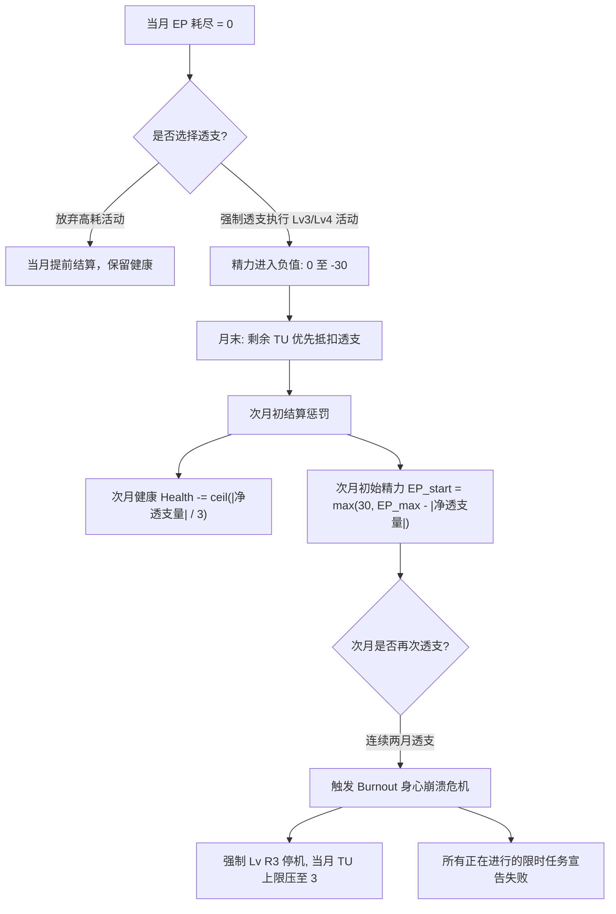

# 07_时间与精力规则

> **版本**：v1.0  
> **责任人**：2号（状态、资源与数值平衡）  
> **适用范围**：全游戏月度决策与行动消耗核心规则。供 1号（月度循环）、3号（事件消耗配置）、4号（进阶路线负载设计）强制遵守。  
> **核心机制**：双资源约束（客观时间 + 主观精力）、机会成本硬约束、透支与过载惩罚、杜绝“全都要”完美刷榜。

---

## 1. 资源系统设计理念

现实中大学生的核心瓶颈从来不是“不知道要做什么”，而是 **“时间有限、精力耗尽、注意力被割裂”**。
为了构建真实的选择取舍感，本模拟器设计了 **双重资源模型**：

```text
┌─────────────────────────────────────────────────────────────┐
│                      月度资源总池                           │
├──────────────────────────────┬──────────────────────────────┤
│    时间单位（Time Units, TU）│   精力点数（Energy Points, EP）│
├──────────────────────────────┼──────────────────────────────┤
│ • 客观不可再生资源           │ • 主观生理与心理能量储备    │
│ • 每月固定 10 点             │ • 受健康与专注度动态调节    │
│ • 代表可支配的核心课外时间块 │ • 代表高强度任务承受力      │
│ • 无法透支，当月不用即清零   │ • 允许有限透支，但有严厉惩罚│
└──────────────────────────────┴──────────────────────────────┘
```

---

## 2. 资源总量与生成机制

### 2.1 时间单位（Time Units, TU）

* **月度固定预算**：每个常规学期月（3—6月、9—12月）固定提供 **$10\text{ TU}$**。
* **物理含义**：$1\text{ TU} \approx 10$ 小时高质量、无干扰的**课外**专注时间（每月共约 100 小时课外自由支配时间）。
  * *说明*：**上课本身不消耗 TU**，它是默认背景。TU 只计量“你可以自己决定怎么花”的那部分时间。因此 Lv 1 的“完成日常课后作业、跟上课程进度”消耗的是课后投入，不是课堂时间。
* **结转规则**：TU 属于流动性时间窗口，**月末不结转、不可存储**。未使用的 TU 按下列顺序结算：
  1. **优先抵扣当月 EP 透支**：每剩余 $1\text{ TU}$ 抵扣 $2$ 点 EP 负值（反映“少做一件事就少熬一次夜”）；
  2. **抵扣后仍有剩余**：每 $3\text{ TU}$ 使健康 $+1$（月末结算，**每月上限 $+2$**），反映规律作息与闲暇恢复；
  3. 其余部分作废。

---

### 2.2 精力点数（Energy Points, EP）

* **精力上限动态公式**：
  每月初，系统根据玩家当前的 **健康 (Health)** 状态计算该月的最大精力上限 $EP_{max}$：
  $$EP_{max} = 60 + \text{Health} \times 0.5$$
  * *算例*：
    * 健康处于【身心卓越】（Health = 90）：$EP_{max} = 60 + 45 = 105$
    * 健康处于【良好充沛】（Health = 80）：$EP_{max} = 60 + 40 = 100$（标准基准）
    * 健康处于【普通疲劳】（Health = 50）：$EP_{max} = 60 + 25 = 85$
    * 健康处于【严重透支】（Health = 20）：$EP_{max} = 60 + 10 = 70$（行动力严重受限）

* **专注度（Focus）对精力消耗的调节（效率修正）**：
  专注度决定了玩家在执行任务时的“心流效率”。实际精力消耗公式为：
  $$EP_{\text{actual}} = \text{Base\_EP} \times \left(1.3 - \frac{\text{Focus}}{100} \times 0.6\right)$$
  * 当 $\text{Focus} = 100$ 时，消耗系数为 $0.7$（心流状态，省精力 $30\%$）。
  * 当 $\text{Focus} = 50$ 时，消耗系数为 $1.0$（正常基准消耗）。
  * 当 $\text{Focus} = 0$ 时，消耗系数为 $1.3$（频繁走神、拖延，多消耗 $30\%$ 精力）。

* **【重要】Focus 修正的作用域**：

| 消耗类型 | 是否受 Focus 修正 | 理由 |
| :--- | :---: | :--- |
| 事件选项的 EP 消耗（Lv 0 — Lv 4） | **是** | 专注度高的人做同一件事更省心力 |
| 休整类行动（Lv R1 — Lv R3） | 否 | 休息不存在“效率” |
| **进阶路线【进行中】的每月驻留成本**（见 §8） | **否** | 驻留成本是路线的**刚性占用**，不因个人效率打折 |
| 危机/惩罚类强制扣减 | 否 | 惩罚不可优化 |

---

### 2.3 健康行动封锁表（硬约束）

$EP_{max}$ 公式中保留了基础值以维持基本操作空间，但健康的真正硬约束由 **行动等级封锁** 兑现。**该表优先级高于一切事件配置**：

| 健康区间 | 当月 TU 上限 | 可执行的最高消耗等级 | 附加修正 |
| :---: | :---: | :---: | :--- |
| **0 — 20**（身心崩溃） | **$3\text{ TU}$** | **仅 Lv 0 与休整类 Lv R** | 强制触发 `CRISIS_BURNOUT_01`；当月所有限时任务判定失约 |
| **21 — 40**（亚健康） | $8\text{ TU}$ | **Lv 2** | Lv 2 活动额外 $+30\%$ EP 消耗；**禁止 Lv 3 / Lv 4** |
| **41 — 60**（普通疲劳） | $10\text{ TU}$ | **Lv 3** | Lv 3 活动额外 $+15\%$ EP 消耗；禁止 Lv 4 |
| **61 — 80**（良好充沛） | $10\text{ TU}$ | Lv 4 | — |
| **81 — 100**（身心卓越） | $10\text{ TU}$ | Lv 4 | Lv 4 的健康扣减减半（$-3 \sim -5$） |

*崩溃状态下保留 $3\text{ TU}$ 专用于休整类行动（Lv R），确保崩溃状态一定有恢复出口，避免死锁。*

---

## 3. 活动消耗等级标准（统一消耗表）

3号在设计事件选项、4号在设计进阶路线时，必须严格按照以下 **5 个标准消耗等级** 配置，不得随意手填数字：

| 等级 | 行为类别 | 典型情境示例 | 消耗 TU | 基础消耗 EP | 附带影响 |
| :---: | :--- | :--- | :---: | :---: | :--- |
| **Lv 0** | **轻量参与/围观** | 听一场讲座、参加一次社团破冰、水群刷信息、陪室友吃顿饭 | **$1\text{ TU}$** | **$5 \sim 10\text{ EP}$** | 几乎不耗心力，轻度社交 |
| **Lv 1** | **常规课业维持** | 完成日常课后作业、跟上课程进度、参加每周例会 | **$2\text{ TU}$** | **$15 \sim 20\text{ EP}$** | 维持现状，防止学业自然衰减 |
| **Lv 2** | **主动投入/小试牛刀** | 期中突击复习、自学 Python 基础、完成 AI-Lab L0 任务卡、写大作业 Demo | **$3\text{ TU}$** | **$25 \sim 35\text{ EP}$** | 产生实质性技能或作品沉淀 |
| **Lv 3** | **核心攻坚/高强度** | 竞赛封闭冲刺、考研数学刷题、AI-Lab 深度任务交付、大厂实习出勤 | **$4 \sim 5\text{ TU}$** | **$45 \sim 60\text{ EP}$** | 推动进阶路线关键状态跃迁 |
| **Lv 4** | **极限救火/透支冲刺** | 连续通宵赶论文 DDL、商业项目紧急上线、双线作战突击 | **$5\text{ TU}$** | **$70 \sim 85\text{ EP}$** | 强制扣减健康：$\text{Health} -6 \sim -10$ |

---

## 4. 休整与恢复规则

### 4.1 主动休整行动表

休整类行动**不消耗 EP**（休息不该再花心力），也**不受 Focus 修正**：

| 等级 | 行为类别 | 典型情境 | 消耗 TU | 消耗 EP | 效果 |
| :---: | :--- | :--- | :---: | :---: | :--- |
| **Lv R1** | **日常调整** | 早睡一周、去操场跑两次步、周末彻底不碰电脑 | $1\text{ TU}$ | $0$ | 健康 $+3$；当场回复 $15\text{ EP}$（不超 $EP_{max}$） |
| **Lv R2** | **主动疗愈** | 回家住几天、约朋友长谈、看心理咨询、断网一周 | $3\text{ TU}$ | $0$ | 健康 $+8$；**清除当月全部 EP 透支负值** |
| **Lv R3** | **就医/强制停机** | 住院、休学休整、被家人接回家 | $3\text{ TU}$ | $0$ | 健康 $+12$；**当月不可执行任何其他行动** |

* Lv R3 在健康 $\le 20$ 时由系统**强制执行**，玩家无选择权（对应 `CRISIS_BURNOUT_01`）。
* 健康 $\le 20$ 时当月 TU 上限为 $3$（见 §2.3），恰好够执行一次 Lv R2 或 Lv R3 —— **这是崩溃状态的唯一出口，不可被任何规则覆盖**。

### 4.2 被动/自然恢复

| 触发条件 | 恢复量 | 结算时点 |
| :--- | :--- | :--- |
| 当月未执行任何 Lv 3 / Lv 4 活动，且健康 $< 60$ | 健康 $+2$ | 月末 |
| 当月剩余 TU 抵扣完透支后仍有富余 | 每 $3\text{ TU}$ 健康 $+1$（月上限 $+2$） | 月末（见 §2.1） |
| 寒暑假选择「策略 A：回家休整」 | 健康 $+15$，家庭 $+10$，EP 回满 | 假期月结算（路线驻留成本自动挂起免扣） |
| 恋爱处于【甜蜜稳定】（$61 \sim 80$） | 每月 EP 额外回复 $+10$，且 `chronic_fatigue` 持续时间缩短 1 个月 | 月初 |

> **设计意图**：让“主动休息”成为一个**需要花 TU 的真实选择**，而不是免费的兜底。
> 一个想同时推进两条路线的玩家，会发现自己连 $1\text{ TU}$ 的 Lv R1 都挤不出来——这正是我们想让玩家体会到的东西。
> 稳态恋爱提供真实的心理托底（抗疲劳与精力回血），但需持续支付每月维持时间，兼顾平衡与现实感。

### 4.3 恢复量的上限约束

* 单月健康恢复总量（主动 + 被动）**不超过 $+15$**，防止“崩溃—疗养—再崩溃”的无损循环刷分；
* 处于 `chronic_fatigue` 标签期间，所有健康恢复量**打 $7$ 折**。

---

## 5. 透支与疲劳机制（Overdrive & Burnout）

大学生活中常有“透支身体赶进度”的情况，系统允许有限度的透支，但绝不允许无代价刷分。



### 5.1 透支规则（Overdrive）
* **最大允许透支量**：$-30\text{ EP}$（当精力低于 $-30$ 时，系统锁死所有需消耗 EP 的操作，只能选择休整类 Lv R 行动）。
* **月末抵扣**：结算惩罚前，先用当月剩余 TU 抵扣透支（$1\text{ TU} = 2\text{ EP}$，见 §2.1），按抵扣后的**净透支量**计算惩罚。
* **次月透支结算惩罚**（平滑梯级惩罚）：
  1. **生理损伤**：$\text{Health} \leftarrow \text{Health} - \lceil |\text{净透支量}| / 3 \rceil$（向上取整，净透支 $1 \sim 3$ 点扣 1 点健康，透支 30 点扣 10 点，杜绝低额透支零扣减的偷跑漏洞）。
  2. **精力损伤**：次月初初始精力按实际净透支量平滑扣减（最低保底 30 点）：$$EP_{\text{start}} = \max\big(30,\ EP_{max} - |\text{净透支量}|\big)$$
     * 例如基准 $EP_{max}=100$，透支 10 点则次月从 $90\text{ EP}$ 开始；透支 30 点则次月从 $70\text{ EP}$ 开始，使违约成本与透支幅度严格线性挂钩。

### 5.2 崩溃危机（Burnout）
* **触发条件**：
  * 条件 A：连续 2 个月精力透支（连续两个月末 EP $< 0$）；
  * 条件 B：健康值降至【严重不足】（$\le 20$）且当月尝试执行 Lv 3 或 Lv 4 活动。
* **崩溃后果**：
  1. 触发特殊强制事件 `CRISIS_BURNOUT_01`（心理/生理全面停机）。
  2. 当月 TU 上限强制压至 **$3\text{ TU}$**，且只能执行 Lv R 休整类行动（保留基本恢复出口）。
  3. 当月已领取的限时任务（AI-Lab任务卡、比赛报名、实习考核）全部因逾期而判定为**失败/失约**，声誉 $\text{Reputation} -15$。
  4. 获得长期负面标签：`chronic_fatigue`（慢性疲劳，持续 3 个月内精力上限 $-15$，且所有健康恢复量打 $7$ 折）。

---

## 6. 寒暑假特殊月份机制（1-2月、7-8月）

寒暑假是大学四年关键的“分水岭”与“修整期”：
* **资源特性**：寒暑假无需上课，每月提供更充裕的课外时间：**$12\text{ TU}$**。
* **策略并非严格二选一**：策略 A / B 是**主基调**，占用假期的主要资源，剩余 TU 仍可用于普通事件与休整行动。

| | 策略 A：回家休整 / 疗愈 | 策略 B：假期攻坚 / 留校 |
| :--- | :--- | :--- |
| **消耗** | $2\text{ TU}$，$0\text{ EP}$ | $8 \sim 10\text{ TU}$，$70 \sim 90\text{ EP}$ |
| **收益** | 健康 $+15$，EP 回满，家庭 $+10$ | 作品集 / 硬技能 / 科研 大幅提升 |
| **附加** | 清除 `chronic_fatigue` 标签；**考研路线自动获得基础复习增益（$+4\text{ 备考度/月}$）** | 抢占实习 / 竞赛 / 科研早鸟优势 |
| **代价** | 技术与普通进阶路线整月停滞（**驻留成本挂起免扣**，无进度增长） | 健康无法自然恢复，且**路线驻留成本照常扣除** |
| **剩余 TU** | $10\text{ TU}$ 可自由分配 | $2 \sim 4\text{ TU}$ 可自由分配 |

*说明：选择策略 A 时，进阶路线进入**休眠/挂起状态**，免扣当月驻留成本，绝不触发未支付惩罚；考研路线在策略 A 期间可通过居家温书获得基础积累（$+4$ 点/月），保留合理通关容错；选择策略 B 则正常扣除驻留成本以换取假期高成长。*

### 6.1 游戏时间轴定义（供 1号 与 4号 对齐）

```text
游戏起点：大一 9 月        游戏终点：大四 6 月（毕业）
总时长：46 个月
```

| 学年 | 学期月（$10\text{ TU}$） | 假期月（$12\text{ TU}$） | 小计 |
| :--- | :--- | :--- | :---: |
| 大一 | 9,10,11,12 / 3,4,5,6 | 1,2（寒假）/ 7,8（暑假） | 12 个月 |
| 大二 | 同上 | 同上 | 12 个月 |
| 大三 | 同上 | 同上 | 12 个月 |
| **大四** | 9,10,11,12 / 3,4,5,6 | 1,2（寒假）**／无暑假** | **10 个月** |
| **合计** | **32 个学期月** | **14 个假期月** | **46 个月** |

* **大四没有暑假**：7—8 月玩家已毕业，游戏在大四 6 月的毕业结算后结束（对接 1号 的“毕业简历收口”）。
* 由此推出四年 TU 总量：$32 \times 10 + 14 \times 12 = 320 + 168 = \mathbf{488\ TU}$。

---

## 7. 月度行动容量模型（为什么不能“全都要”）

一个常规月份、健康处于基准值（$\text{Health} = 80$）的玩家拥有 $10\text{ TU}$ 和 $100\text{ EP}$。

### 7.1 组合算例 A：极致考研复习流（单线极致）
* 考研数学+专业课高强度刷题（Lv 3）：$5\text{ TU}, 55\text{ EP}$
* 维持专业课不挂科（Lv 1）：$2\text{ TU}, 20\text{ EP}$
* 日常调整、保住身体（Lv R1）：$1\text{ TU}, 0\text{ EP}$
* **合计消耗**：$8\text{ TU}, 75\text{ EP}$。
* **剩余结余**：$2\text{ TU}, 25\text{ EP}$。
* **结论**：学业与考研指标健康增长，但 **没有任何剩余资源去经营大厂全职实习（需 $5\text{ TU}+55\text{ EP}$）**。

### 7.2 组合算例 B：贪婪双修流（考研 + 秋招）
* 考研【进行中】驻留：$5\text{ TU}, 50\text{ EP}$（**不受 Focus 修正**，见 §2.2）
* 大厂求职/实习【进行中】驻留：$5\text{ TU}, 55\text{ EP}$（同样不受 Focus 修正）
* **需求总量**：$10\text{ TU}, 105\text{ EP}$。
* **系统判定**：
  * TU：恰好占满 $10/10$，**零余量**——本月无法应对任何突发事件（期末周、家庭电话、身体不适、任务卡 DDL）；
  * EP：$105 > 100$，当月即进入透支状态，次月健康扣除 $\lceil 5/3 \rceil = 2$ 点，且次月初始精力扣减至 $95\text{ EP}$。
* **再叠加任何第三件事**（哪怕只是 Lv 1 的课业维持 $2\text{ TU}+20\text{ EP}$）：TU 缺口 $2$ 点，EP 透支扩大到 $-25$，逼近 $-30$ 红线。

### 7.3 资源容量结论

> **在当前双资源模型下，同月并行 2 条【进行中】高强度进阶路线，会同时耗尽 TU 并击穿 EP；玩家将失去应对一切突发事件的余量，且在 2—3 个月内被透支惩罚累积推入 Burnout。**

---

## 8. 3号与4号对接配置指南

1. **3号制作事件时**：
   * 必须在每个选项后标明统一资源语法 `【资源消耗】：[Lv x | TU: a | EP: b]`（唯一格式，定义见 `08` §7.3）。
   * 如果某个选项导致玩家透支，必须打 `精力[当月透支]` 标签，UI 明确提示
     `【警告：此举将透支身体，下月健康与精力将受到惩罚】`。
   * **不得**为休整类行动配置 EP 消耗（Lv R 系列固定 $0\text{ EP}$）。
2. **4号设计路线时**：路线【进行中】的每月**驻留成本**必须符合下表。

### 8.1 路线驻留成本表（唯一权威来源）

| 路线名称 | 【进行中】每月驻留成本 | 若当月未支付驻留成本的惩罚 |
| :--- | :--- | :--- |
| **保研路线 (RE)** | **$4\text{ TU} + 40\text{ EP}$**（维持顶尖绩点 + 科研/竞赛） | 学业按 Tier 2 自然下滑，`flag_gpa_top_10` 判定失效 |
| **考研路线 (GE)** | $5\text{ TU} + 50\text{ EP}$（海量刷题与背诵） | **考研备考度 $-10$**（变量定义见 `09` §2.1） |
| **大厂求职/实习 (WK)** | $5\text{ TU} + 55\text{ EP}$（实习出勤与笔面试） | 交付力 `[一般下降]`，实习考核评级下调一档 |
| **AI-Lab 深度线** | $3\text{ TU} + 35\text{ EP}$（代码开发与项目会议） | 任务卡延期：声誉 $-8$，交付力 `[一般下降]` |
| **真实战场线** | $6\text{ TU} + 70\text{ EP}$（高强度商业级交付） | 试做失败，直接退出真实战场线 |

### 8.2 驻留成本的结算约定（给 1号）

* 驻留成本在**月初**扣除，先于玩家的任何自主选择；
* 驻留成本 **不受 Focus 修正**（见 §2.2），**不受健康行动封锁影响**（路线不会因为玩家生病就停止索取）；
* **保研免衰减关联**：保研【进行中】正常扣除驻留成本的月份，其消耗包含顶尖课业维持，**自动满足当学期课业免衰减条件**（等同于执行了 Lv 1 课业维持），无需重复执行；
* **假期例外约定**：寒暑假若玩家主基调选择「策略 A：回家休整」，进阶路线自动挂起，当月**免扣驻留成本**，也不判定未支付惩罚；
* 若学期常规月月初扣除后 TU 或 EP 不足，判定为“当月未支付驻留成本”，按 §8.1 惩罚列结算，路线状态**不立即回退**，但连续 2 个月未支付则由 4号 的路线规则决定是否转入【放弃】。
