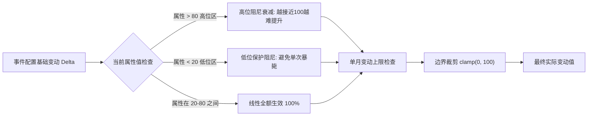

# 08_数值变化统一规范

> **版本**：v1.0  
> **责任人**：2号（状态、资源与数值平衡）  
> **适用范围**：所有事件、路线分支、结局结算的状态增减标准。供 3号（事件撰写）、4号（路线编写）强制使用。  
> **核心原则**：语义化分级、拒绝拍脑袋数值、边际阻尼递减、代价对称权衡、**变动绝不越界**。

---

## 1. 规范背景与解决痛点

在多成员协同设计叙事与分支游戏时，最常见的问题是 **“数值尺度混乱”**：
* 成员 A 写的事件中“参加一次自习”给学业 `+20`；
* 成员 B 写的事件中“拿到了全国一等奖”只给学业 `+5`；
* 成员 C 随意手写“恋爱值 `+17`，健康 `-33`”。

这种混乱会导致数值瞬间通胀、游戏失去平衡。
因此，**3号和4号在策划事件与路线时，禁止直接随意填写阿拉伯数字**，必须统一使用本文档定义的 **语义化变化等级**。底层代码或数值引擎将自动把语义等级映射为精确数值。

---

## 2. 统一数值变化等级（五级标尺）

所有状态与能力变量的单次变动，严格划分为以下 **5 个标准等级**：

| 等级代码 | 语义名称 | 数值标准区间 | 弱 / 默认 / 强 | 现实情境对应级别 | 建议出现频率 |
| :---: | :---: | :---: | :---: | :--- | :---: |
| **Tier 1** | **微幅变动 (Minor)** | $\pm 1 \sim 3$ | $1$ / $\mathbf{2}$ / $3$ | 随手一翻的微小积累、一次普通的日常问候、一次走神 | 高频（日常伴随） |
| **Tier 2** | **一般变动 (Normal)** | $\pm 4 \sim 7$ | $4$ / $\mathbf{5}$ / $7$ | 认真准备一次小测、参加一次周末社团活动、完成一次约会 | 中频（常规事件） |
| **Tier 3** | **明显变动 (Major)** | $\pm 8 \sim 12$ | $8$ / $\mathbf{10}$ / $12$ | 期中考前通宵突击、完成一个完整课程 Demo、一次激烈争吵 | 低频（每月重点） |
| **Tier 4** | **重大变动 (Severe)** | $\pm 15 \sim 22$ | $15$ / $\mathbf{20}$ / $22$ | 期末考挂科/满绩、拿到国家级竞赛奖项、大厂转正面试、分手 | 极低（学期节点） |
| **Tier 5** | **极端/转折 (Critical)** | $\pm 26 \sim 35$ | $26$ / $\mathbf{30}$ / $35$ | 身心彻底崩溃住院、保研资格被取消、创业公司核心破产 | 罕见（危机/结局） |

### 2.1 弱 / 强修饰语法

允许在标签后追加**一个**修饰词，取该 Tier 区间的下界或上界：

```text
学业[明显提升]        →  +10   （默认值）
学业[明显提升·强]     →  +12   （该 Tier 上界）
学业[明显提升·弱]     →  +8    （该 Tier 下界）
```

**不允许跨 Tier 修饰**（不存在 `[明显提升·极强]`）。若某情境的分量确实超出 Tier 3 上界，说明它本身就该是 Tier 4。

---

## 3. 各属性在各等级下的具象映射表

为了帮助 3号和 4号在编写事件时准确把握分寸，各属性在不同等级下的典型情境映射如下：

| 属性名称 | Tier 1（微幅 $\pm 2$） | Tier 2（一般 $\pm 5$） | Tier 3（明显 $\pm 10$） | Tier 4（重大 $\pm 20$） |
| :--- | :--- | :--- | :--- | :--- |
| **学业 (Academic)** | 读完一章教材，做对一道习题 | 认真完成一次实验报告，考前常规复习 | 期中考试取得高分，自学完一门核心网课 | 期末多门核心课满绩，或单科严重挂科 |
| **社交 (Social)** | 朋友圈点赞，寝室闲聊 | 参加一次部门例会，与学长交流半小时 | 主办一次院系级活动，加入核心技术圈子 | 竞选成为学生会主席/社长，或遭遇圈子全面排挤 |
| **恋爱 (Romance)** | 微信分享日常动态，互道晚安 | 一起在食堂吃顿饭，看一场电影 | 浪漫告白成功，或因异地产生严重冷战 | 确定长远结婚/同城规划，或经历痛苦分手 |
| **家庭 (Family)** | 每周常规报平安电话 | 父母寄来家乡特产，假期愉快相处 | 父母全力支持某项培训，或因考研择校发生争执 | 父母大病/经济危机，或因违抗家庭意愿彻底吵翻 |
| **健康 (Health)** | 晨跑 2 公里，晚上少刷半小时手机 | 坚持一周早睡，或单次熬夜到凌晨两点 | 连续一周高强度熬夜赶 DDL，或长假深度疗休养 | 突发急性肠胃炎住院，或重度焦虑神经衰弱 |
| **作品集 (Portfolio)** | 整理一次 GitHub 仓库 README | 完成一个小功能模块，写了一篇学习笔记 | 上线一个可用 Web Demo，完成一张 AI-Lab 任务卡 | 独立完成商业级项目并有真实用户 |
| **科研 (Research)** | 读懂一篇论文的摘要与结论 | 完成一次文献综述整理，跑通导师给的实验脚本 | 独立完成一组可复现实验，做出组会汇报 | 发表一作学术论文，或拿到导师强推荐信 |
| **硬技能 (Skill)** | 掌握几个常用 Linux/Git 快捷命令 | 学会使用 Docker 打包部署基础服务 | 独立在本地搭建并调试成功复杂开源模型 | 具备端到端全栈架构或深度科研攻关实操能力 |
| **交付力 (Delivery)** | 按要求提交格式正确的周报 | 在小任务截止前提前交付，并完成自测 | 面对复杂模糊需求，按时保质给出完整闭环交付 | 作为核心主导完成大型高压商业项目的准时上线 |
| **声誉 (Reputation)** | 守时赴约，未迟到 | 团队协作中主动承担琐碎杂活并保质完成 | 在团队危机时刻站出来救火，获得学长强力推荐 | 发生严重学术不端/项目严重失约/甩锅他人 |
| **专注度 (Focus)** | 关闭手机通知专心自习 1 小时 | 连续 3 天保持规律无手机学习节奏 | 闭关一个月专心备考，拒绝一切无效社交娱乐 | 深度沉浸于极度热爱的技术领域，达到心流境界 |
| **AI深度 (AI-Depth)** | 尝试用 AI 助手润色一段文本 | 掌握 Prompt 工程技巧与本地 API 调用 | 熟练搭建 RAG 管道或调试微调开源大模型 | 具备前沿 Agent 架构设计或扩散模型深度优化能力 |

---

## 4. 边际递减阻尼与边界保护机制（数学公式）

为了防止玩家在游戏前期通过重复刷某类事件导致特定属性“数值爆表”，系统在数值底层引入 **非线性边际递减阻尼（Marginal Diminishing Returns）**：



### 4.1 高位阻尼公式（防止溢出）

当玩家当前属性值 $V_{\text{current}} > 80$ 时，正向增益 $\Delta > 0$ 将受到高位阻尼压缩：

$$\Delta_{\text{actual}} = \min\Big(\ \max\big(0,\ \lfloor \Delta \times \tfrac{100 - V_{\text{current}}}{20} \rfloor\big),\ \ \mathbf{100 - V_{\text{current}}}\ \Big)$$

* **高位事件分级准入规则（消除低阶日常套利）**：
  * 当 $V_{\text{current}} > 90$ 时，Tier 1（$\Delta = +2$）微幅日常事件经阻尼计算后 $\lfloor 2 \times \frac{<10}{20} \rfloor = 0$，**不再提供上限提升**（仅作为日常行为维持状态、防自然衰减）；
  * 只有 Tier 2（$\Delta \ge 5$）及以上的中高强度攻坚事件，才能产生有效增益推动属性向 $95+$ 拔尖冲刺。
* *算例验证*：
  * $V = 80$，Tier 3（$\Delta = +10$）：$\min(\max(0, \lfloor 10.0 \rfloor),\ 20) = +10 \implies$ 学业提升至 $90$
  * $V = 92$，Tier 1（$\Delta = +2$）：$\min(\max(0, \lfloor 0.8 \rfloor),\ 8) = \mathbf{0} \implies$ 学业保持 $92$（防衰减，不拔高）
  * $V = 92$，Tier 2（$\Delta = +5$）：$\min(\max(0, \lfloor 2.0 \rfloor),\ 8) = \mathbf{+2} \implies$ 学业提升至 $94$
  * $V = 95$，Tier 3（$\Delta = +10$）：$\min(\max(0, \lfloor 2.5 \rfloor),\ 5) = \mathbf{+2} \implies$ 学业提升至 $97$
  * $V = 100$，Tier 3（$\Delta = +10$）：$\min(\max(0, 0),\ \mathbf{0}) = \mathbf{0} \implies$ 保持 $100$，**绝不溢出**

* **设计意图**：从 80 分提升到 90 分需要付出努力，从 95 分提升到 99 分必须依靠高阶成果，日常闲聊翻书无法使属性达到顶尖大圆满。
* **阻尼与门槛设计的配合**：相邻门槛间距必须另行约束，见 §5.2。

### 4.2 低位保护阻尼（防止单次误杀）

当玩家当前属性值 $V_{\text{current}} < 20$ 时，常规的负向扣减 $\Delta < 0$ 将受到保护性缓冲，避免一个普通负面事件直接将玩家扣到负数：

$$\Delta_{\text{actual}} = -\min\Big(\ \max\big(1,\ \lfloor |\Delta| \times \tfrac{V_{\text{current}}}{20} \rfloor\big),\ \ \mathbf{V_{\text{current}}}\ \Big)$$

* *算例验证*：
  * $V = 19$，Tier 3（$\Delta = -10$）：$-\min(\max(1, 9),\ 19) = -9 \implies 10$
  * $V = 5$，Tier 3（$\Delta = -10$）：$-\min(\max(1, 2),\ 5) = -2 \implies 3$
  * $V = 0$，Tier 3（$\Delta = -10$）：$-\min(\max(1, 0),\ \mathbf{0}) = \mathbf{0} \implies$ 保持 $0$，**绝不跌破下界**

*(注：被标记为 `CRITICAL_PENALTY` 的极端危机事件不受低位保护限制，但仍受 $[0,100]$ 边界裁剪约束。)*

### 4.3 最终边界保证（给 1号 的实现兜底约定）

无论经过何种阻尼、耦合、自然衰减或危机结算，引擎在写回玩家状态前必须统一执行：

$$V_{\text{new}} = \mathrm{clamp}\big(V_{\text{old}} + \Delta_{\text{actual}},\ 0,\ 100\big)$$

**这是一条兜底约定**：即使某条规则在编写时出现疏漏，也不允许任何状态离开 $[0, 100]$ 闭区间。

---

## 5. 单月变动上限与门槛间距

### 5.1 同属性单月变动上限

| 规则 | 内容 |
| :---: | :--- |
| **R1** | 同一属性在同一月内，**最多接受 1 次 Tier 3 及以上的正向变动**；第二次及以后的 Tier 3+ 正向变动自动降级为 Tier 2 |
| **R2** | 同一属性在同一月内，**正向**累计变动不得超过 $+22$（Tier 4 上界）；**负向不受此限**——危机应当能够剧烈打击玩家 |
| **R3** | R1、R2 对标记为 `CRITICAL_PENALTY` 的强制危机事件不生效 |

### 5.2 门槛间距设计规则（给 4号 的硬约束）

由 R1 与 §4.1 的阻尼实际形状，可推出一条门槛设计规则：

> **若相邻两级门槛设在同一变量上且后者更高，其差值应当 $\ge 12$（一次 Tier 3 的上界）。**
> 若做不到，就不要在该变量上抬高门槛，而应改为在**另一个变量**上设卡口（例如在交付力、声誉等需长期积累的维度设卡口）。

* `09_进阶路线数值门槛表` 中所有门槛均已按此规则配置。

---

## 6. 收益与代价的对称平衡法则（Zero-Sum Tradeoff）

为了杜绝“只有收益、毫无代价”的无脑最优解，所有 Tier 3 以上的正向收益选项，必须遵循 **“能量守恒与机会成本法则”**，附带相应的代价扣减：

| 核心正向收益 | 必须伴随的代价（至少一项） |
| :--- | :--- |
| 学业 / 硬技能 / 作品集 / 科研 `[明显提升]` | 消耗 Lv 2 以上资源，**或** 健康 `[一般下降]` |
| 社交人脉 / 干部声望 `[重大提升]` | 专注度 `[明显下降]`，**或** 学业 `[一般下降]` |
| 恋爱 `[明显升温]` | 此后每月固定占用 $1 \sim 2\text{ TU}$，**或** 考研备考度当月停滞 |
| AI-Lab 深度交付 `[重大提升]` | 高负荷 EP 消耗 **且** 承担逾期声誉风险（见 `09` §3） |
| 家庭 `[明显提升]` | 占用整个假期（放弃该假期的攻坚策略 B） |

---

## 7. 标准书写语法（供 3号、4号直接复制使用）

### 7.1 状态与能力变动标签（单调属性）

适用于：**学业、社交、家庭、健康**，以及全部 7 项能力资产（作品集、科研、硬技能、交付力、声誉、专注度、AI深度）。

| 提升标签 | 底层值 | | 下降标签 | 底层值 |
| :--- | :---: | :--- | :--- | :---: |
| `属性[微幅提升]` | $+2$ | | `属性[微幅下降]` | $-2$ |
| `属性[一般提升]` | $+5$ | | `属性[一般下降]` | $-5$ |
| `属性[明显提升]` | $+10$ | | `属性[明显下降]` | $-10$ |
| `属性[重大提升]` | $+20$ | | `属性[重大下降]` | $-20$ |
| `属性[飞跃突破]` | $+30$ | | `属性[崩盘受挫]` | $-30$ |

* 可追加 `·强` / `·弱` 修饰取该 Tier 的上/下界，见 §2.1。
* ⚠️ **家庭属性特别提示**：本系统中「家庭」代表**家庭支持度与托底度（高=好）**，因此 `家庭[提升]` 代表家庭理解支持增加、经济或心理压力减轻；`家庭[下降]` 代表家庭阻力增大或经济紧张。请 3号 避免按任务书的“家庭压力”进行反向配置。

### 7.2 恋爱专用标签（非单调属性）

**恋爱是全系统唯一的非单调轴**：它衡量的是「情感投入度」，而不是「情感质量」。

```text
 10  严重内耗        30  健康单身        50  暧昧试探        75  甜蜜稳定        88  深度绑定
  ↑ 坏               ↑ 好               ↑ 开始花时间      ↑ 好               ↑ 毕业去向被绑死
```

数值高 $\ne$ 状态好。因此**禁止对恋爱使用 §7.1 的提升/下降标签**，必须使用下列专用标签：

| 标签 | 底层值 | 典型情境 |
| :--- | :---: | :--- |
| `恋爱[微幅升温]` | $+2$ | 日常互动、互道晚安 |
| `恋爱[一般升温]` | $+5$ | 一次约会、一次坦诚沟通 |
| `恋爱[明显升温]` | $+10$ | 告白成功、关系确立、共渡难关 |
| `恋爱[重大升温]` | $+20$ | 确立长期规划、共同择校/择城 |
| `恋爱[微幅降温]` | $-2$ | 小摩擦、几天没联系 |
| `恋爱[一般降温]` | $-5$ | 一次争执、异地疲惫 |
| `恋爱[明显降温]` | $-10$ | 严重冷战、信任受损 |
| `恋爱[重大降温]` | $-20$ | 分手、被拒绝、异地决裂 |

> **3号 编写恋爱事件时必须注意**：`升温` 不等于「好结果」。把 $30$（平稳单身）推到 $45$（暧昧期）会开始每月消耗 $1 \sim 2\text{ TU}$；把 $75$ 推到 $88$ 会在大四触发毕业去向强绑定。这些都是代价，事件文本应当如实呈现。

### 7.3 资源消耗语法

统一格式：

```text
【资源消耗】：[Lv x | TU: a | EP: b]
```

* `Lv x` — 消耗等级，取值 `Lv 0` ~ `Lv 4`（行动）或 `Lv R1` ~ `Lv R3`（休整），定义见 `07` §3 与 §4.1；
* `TU` / `EP` — 实际取值，必须落在 `07` §3 消耗表声明的区间内；
* 休整类 `Lv R` 的 EP 恒为 $0$。

### 7.4 资源状态标签

| 标签 | 含义 | 引擎行为 |
| :--- | :--- | :--- |
| `精力[当月透支]` | 该选项会使当月 EP 结算为负 | 记录净透支量，次月初执行 `07` §5.1 惩罚 |
| `精力[即时回复 +N]` | 立即回复 $N$ 点 EP（不超过 $EP_{max}$） | 休整类行动专用 |
| `时间[路线占用 N TU]` | 此后每月锁定 $N$ 点 TU | 路线【进行中】驻留成本专用，见 `07` §8.1 |

**强制要求**：任何带 `精力[当月透支]` 的选项，UI 必须显示 `【警告：此举将透支身体，下月健康与精力将受到惩罚】`。

### 7.5 示范卡片

```markdown
【选项 A】：通宵补齐课程大作业所有缺失功能并包装成比赛作品
【资源消耗】：[Lv 4 | TU: 5 | EP: 75]
【状态影响】：
  - 作品集[明显提升]
  - 硬技能[一般提升]
  - 交付力[一般提升]
  - 健康[明显下降]
  - 精力[当月透支]
```

```markdown
【选项 B】：陪对方过纪念日，大作业交给队友收尾
【资源消耗】：[Lv 2 | TU: 3 | EP: 25]
【状态影响】：
  - 恋爱[明显升温]
  - 交付力[一般下降]
  - 声誉[微幅下降]
```

```markdown
【选项 C】：什么都不做，早点睡
【资源消耗】：[Lv R1 | TU: 1 | EP: 0]
【状态影响】：
  - 健康[微幅提升·强]
  - 精力[即时回复 +15]
```

---

## 8. 给 1号 的实现要点清单

1. 语义标签 $\to$ 数值的映射表在**引擎侧集中维护**，事件数据中不得出现裸数字；
2. 结算顺序固定为：
   `语义解析 → Tier 修饰(§2.1) → 阻尼计算(§4.1/4.2) → 单月上限检查(§5.1) → 边界裁剪(§4.3) → 写回`；
3. §5.1 的单月上限需要一张 `本月已变动记录表`（属性 → 本月已应用的最高 Tier、正向累计值），月初清空；
4. 恋爱使用独立标签命名空间，引擎在加载事件数据时应校验：对 `romance` 字段使用了 §7.1 的标签 $\Rightarrow$ **报错**，反之亦然。
