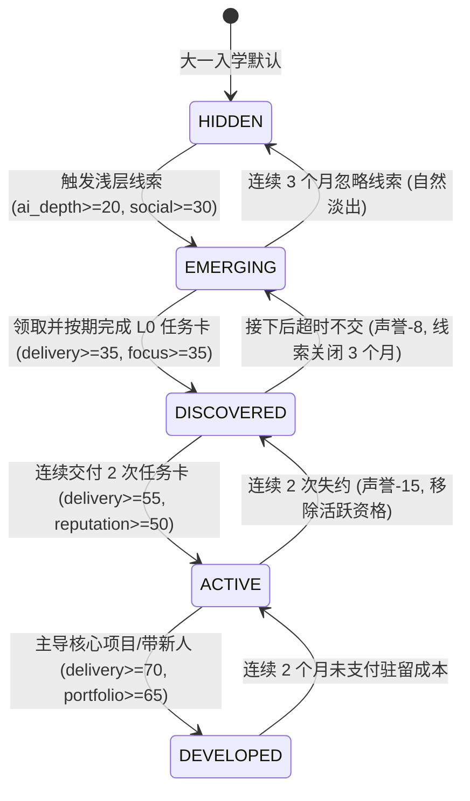

# 09_进阶路线数值门槛表

> **版本**：v1.0  
> **责任人**：2号（状态、资源与数值平衡）  
> **适用范围**：三大主进阶路线（保研、考研、就业）及两大特殊线（AI-Lab隐藏线、真实战场线）的状态流转数值门槛。供 1号（逻辑判定）、3号（事件触发）、4号（路线设计）统一执行。  
> **核心原则**：标准状态机流转、硬性量化指标、前置经历校验、杜绝含糊其辞。

> ⚠️ **职责边界声明**：
> 《工作约束与固定产出规范》§7 规定：「2号不单独决定：哪个月开始出现保研路线。这属于4号的路线设计。」
> 本表的「时间窗口」列以及 §5 的路线冲突测算为 **2号 测算建议值**。若 4号 在《16—19》号文档中给出不同窗口，以 4号 为准，2号 负责复核数值平衡。

---

## 1. 路线状态机与数值流转机制

所有进阶路线严格遵守 1号 定义的五段式状态机：
$$\text{锁定 (LOCKED)} \xrightarrow{\text{门槛1}} \text{潜在 (POTENTIAL)} \xrightarrow{\text{门槛2}} \text{可选择 (SELECTABLE)} \xrightarrow{\text{玩家决策}} \text{进行中 (IN\_PROGRESS)} \xrightarrow{\text{考核}} \text{完成 (COMPLETED)} / \text{放弃 (ABANDONED)}$$

2号将 4号提出的定性描述（如“需要较好学业基础”、“需要靠谱交付”）精确量化为基础状态、能力变量、资源消耗和前置标签的数学条件。

### 1.1 两种成本的区分

| 列名 | 含义 | 结算时点 |
| :--- | :--- | :--- |
| **进入成本** | 完成这次状态转移所需的**一次性**投入 | 转移发生的当月，一次性扣除 |
| **驻留成本** | 处于**转移后的目标状态**时，每月的**刚性**占用 | 每月月初自动扣除，先于玩家一切自主选择 |

* 驻留成本 **不受 Focus 修正**、**不受健康行动封锁豁免**（见 `07` §2.2 与 §8.2）；
* 【进行中】状态的驻留成本必须与 `07` §8.1 的《路线驻留成本表》**完全一致**，那张表是唯一权威来源。

### 1.2 本表使用的路线局部变量

以下变量**只在对应路线激活期间存在**，不属于玩家的全局状态，由 1号 在路线对象内维护：

| 变量 | 所属路线 | 范围 | 计算方式 |
| :--- | :--- | :---: | :--- |
| **`exam_prep`（考研备考度）** | 考研 (GE) | $0 \sim 100$ | 初值 $0$。每支付一次【进行中】驻留成本 $+8$；每月未支付 $-10$；专注度 $\ge 60$ 时每月额外 $+2$；暑假选择策略 A 期间每月基础温书 $+4$ |
| **`resume_sent`（简历投递数）** | 工作 (WK) | 计数 | 每次投递类事件 $+1$；通过初筛另计 |
| **`task_card_streak`（任务卡连续交付数）** | AI-Lab | 计数 | 按期交付 $+1$；逾期归零 |

---

## 2. 进阶路线数值门槛总表

> 「时间窗口」列均为 **2号建议值 · 待 4号 确认**。

### 2.1 保研路线 (RE)

| 状态转移 | 时间窗口 ⚠️ | 基础状态门槛 | 能力变量门槛 | 进入成本 | 驻留成本/月 | 前置标记与结局收口 |
| :--- | :--- | :--- | :--- | :---: | :---: | :--- |
| 锁定 → 潜在 | 大二上 (10月) | 学业 $\ge 70$，健康 $\ge 40$ | — | — | — | `flag_failed_course == false` |
| 潜在 → 可选择 | 大三下 (3—5月) | 学业 $\ge 82$ | 科研 $\ge 50$ **或** 作品集 $\ge 55$ | $2\text{ TU}+20\text{ EP}$ | $3\text{ TU}+30\text{ EP}$ | `flag_gpa_top_10 == true` |
| 可选择 → 进行中 | 大三下 (6月)—大四上 (9月) | 学业 $\ge 82$，健康 $\ge 35$ | 交付力 $\ge 50$，声誉 $\ge 50$ | $3\text{ TU}+30\text{ EP}$ | **$4\text{ TU}+40\text{ EP}$** | 获得推免资格或夏令营优秀营员（自动计入学期课业免衰减） |
| 进行中 → 完成 | 大四上 (10月) | 学业 $\ge 80$，无违纪 | 毕设导师确认 | $2\text{ TU}+15\text{ EP}$ | — | 签署推免拟录取协议；收口至 **E01 绩点型保研** 或 **E02 科研型保研**（取决于科研资产，见 §6） |
| 任意 → 放弃/失败 | 任意节点 | 学业 $< 80$ **或** `flag_failed_course == true` | — | — | — | 置 `flag_re_failed = true`，转入考研或校招路线 |
| **【警告区】** | 任意节点 | 学业 $\in [80, 82)$ | — | — | 照常 | 连续 2 个月处于此区间 $\Rightarrow$ 降级回【潜在】 |

### 2.2 考研路线 (GE)

| 状态转移 | 时间窗口 ⚠️ | 基础状态门槛 | 能力变量门槛 | 进入成本 | 驻留成本/月 | 前置标记与结局收口 |
| :--- | :--- | :--- | :--- | :---: | :---: | :--- |
| 锁定 → 潜在 | 大二下 (3月)—大三上 (9月) | 学业 $\ge 45$，家庭 $\ge 30$ | 专注度 $\ge 40$ | — | — | 对直接就业迷茫或有深造意愿 |
| 潜在 → 可选择 | 大三下 (3月) | 健康 $\ge 40$，家庭 $\ge 40$ | 专注度 $\ge 50$ | $2\text{ TU}+20\text{ EP}$ | $2\text{ TU}+20\text{ EP}$ | 确定目标院校层次 |
| 可选择 → 进行中 | 大三下 (3月)—大四上 (12月) | 健康 $\ge 30$，**恋爱 $> 20$** | 专注度 $\ge 55$ | $3\text{ TU}+30\text{ EP}$ | **$5\text{ TU}+50\text{ EP}$** | — |
| 进行中 → 初试过线 | 大四上 (12月) | — | **`exam_prep` $\ge 65$** | $6\text{ TU}+70\text{ EP}$ | **$2\text{ TU}+20\text{ EP}$** (1~2月) | 过目标院校初试线，进入复试筹备期（允许 1~2 个月合理容错） |
| 初试过线 → 录取完成 | 大四下 (3月) | 学业 $\ge 70$ | 专注度 $\ge 65$；科研/硬技能加分 | $4\text{ TU}+40\text{ EP}$ | — | 复试通过，正式收口至 **E03 考研上岸** |
| 任意/初试 → 失利/放弃 | 大四上 12月 或 大四下 3月 | — | **12月初试时 `exam_prep` $< 65$**，或 3月复试未过，或连续 2 月未支付驻留 | — | — | 置 `flag_exam_failed = true`，收口至 **E04 考研失利转就业**（春招补救）或二战 |

### 2.3 工作/校招路线 (WK)

| 状态转移 | 时间窗口 ⚠️ | 基础状态门槛 | 能力变量门槛 | 进入成本 | 驻留成本/月 | 前置标记与结局收口 |
| :--- | :--- | :--- | :--- | :---: | :---: | :--- |
| 锁定 → 潜在 | 大二下 (5月)—大三上 (9月) | 学业 $\ge 40$ | 硬技能 $\ge 35$ **或** 作品集 $\ge 25$ | — | — | 开始关注实习招聘 |
| 潜在 → 可选择 | 大三下 (3—5月) | 健康 $\ge 40$，家庭 $\ge 20$ | 作品集 $\ge 45$，硬技能 $\ge 45$，交付力 $\ge 40$ | $2\text{ TU}+20\text{ EP}$ | $3\text{ TU}+35\text{ EP}$ | 拥有至少一个可讲清楚的 Demo |
| 可选择 → 进行中 | 大三下 (6月)—大四上 (11月) | 健康 $\ge 35$ | 交付力 $\ge 55$，声誉 $\ge 45$，作品集 $\ge 55$ | $3\text{ TU}+35\text{ EP}$ | **$5\text{ TU}+55\text{ EP}$** | **`resume_sent` $\ge 10$** 且至少 1 次通过初筛 |
| 进行中 → 完成 | 大四上 (10—12月) 或 大四下 (4月) | — | 作品集 $\ge 60$，交付力 $\ge 60$ | $2\text{ TU}+20\text{ EP}$ | — | 收到正式录用 Offer；根据能力资产分别收口至 **E05 / E06 / E07 / E10 / E13 / E14**（定量判定见 §6） |
| 进行中 → 放弃/未果 | 大四下 (5月) | — | 作品集 $< 40$ **且** 交付力 $< 40$ | — | — | 置 `resume_blank = true`，收口至 **E11 待业/慢就业** |

---

## 3. AI-Lab 隐藏成长线五阶段数值门槛

AI-Lab 隐藏线不作为常规可选路线，而是作为跨越四年的 **能力孵化与隐藏跳板**：



### 3.1 详细阶段数值指标

| 隐藏阶段代码 | 阶段中文名称 | 激活时间 ⚠️ | 基础状态要求 | 核心变量要求 | 玩家可见性 | 逾期/失约惩罚 |
| :--- | :--- | :--- | :--- | :--- | :--- | :--- |
| **Stage 1: HIDDEN** | **完全隐藏** | 大一全学年 | 无特殊限制 | `ai_depth` $< 20$ | 玩家完全不可见，只展示普通校园生活 | 无 |
| **Stage 2: EMERGING** | **开始显现** | 大一下—大二上 | 健康 $\ge 40$ | `ai_depth` $\ge 20$, 社交 $\ge 30$ | 偶然在群里/讲座/学长动态看到 AI 项目、任务卡消息 | 无（连续 3 个月忽略则退回 HIDDEN） |
| **Stage 3: DISCOVERED** | **玩家发现** | 大二上—大二下 | 健康 $\ge 45$, 专注度 $\ge 35$ | `delivery` $\ge 35$, `skill` $\ge 30$, `ai_depth` $\ge 35$ | 明确知晓社团/实验室存在，并成功接下第一张 L0 任务卡 | 接下后超时不交：声誉 $-8$，退回 EMERGING，线索关闭 3 个月 |
| **Stage 4: ACTIVE** | **主动投入** | 大二下—大三下 | 健康 $\ge 45$ | `delivery` $\ge 55$, `reputation` $\ge 50$, `portfolio` $\ge 40$ | 成为稳定核心成员 | 连续 2 次拖延未交：声誉 $-15$，退回 DISCOVERED |
| **Stage 5: DEVELOPED** | **形成质变** | 大三下—大四全学年 | 健康 $\ge 50$, 专注度 $\ge 55$ | `delivery` $\ge 70$, `portfolio` $\ge 65$, `ai_depth` $\ge 65$ | 拥有完整独立项目资产、一作论文或上线开源项目 | 连续 2 个月未支付驻留成本：退回 ACTIVE |

*声誉救赎通道：处于降级状态时，玩家可通过主动承担补救性代码重构/公开复盘（Lv 2 / Lv 3）快速修复声誉 $+8 \sim 10$，恢复状态机爬回可行性。*

### 3.2 AI-Lab 的真实机会成本

**Stage 4 / Stage 5 的驻留成本**：$3\text{ TU} + 35\text{ EP}$ / 月（与 `07` §8.1 一致）。
除资源占用外，追加以下三条**真实代价**：

| 代价 | 内容 |
| :--- | :--- |
| **课业挤占** | `ACTIVE` / `DEVELOPED` 期间，学期免衰减门槛由 2 次学业事件提升至 **3 次**（见 `06` §2.1） |
| **高峰月撞车** | 任务卡 DDL 与期末月（6月、12月）、秋招高峰（9—11月）**强制重叠**，该月 AI-Lab 驻留成本上浮至 $4\text{ TU} + 45\text{ EP}$ |
| **成果转化打折** | AI-Lab 沉淀向各路线的转化率**并非 100%**，见 §5.2 |

---

## 4. 真实战场线（Real Battle）高阶数值门槛

真实战场线是 AI-Lab 深度沉淀者的最高阶产业级实战分支（映射产业 AI 落地团队、高薪项目制合作、创业学长硬核内推）：

### 4.1 准入门槛（必须全部满足，AND 逻辑）
1. **隐藏状态要求**：AI-Lab 必须处于 `ACTIVE` 或 `DEVELOPED` 阶段；
2. **交付力**：`delivery` $\ge 70$（极度靠谱，从不画饼）；
3. **声誉**：`reputation` $\ge 65$（行业学长口碑极高）；
4. **硬核资产**：`portfolio` $\ge 60$ **或** `skill` $\ge 65$（至少有一项拿得出手的真成果）；
5. **身体底线**：健康 $\ge 45$（身体不能处于亚健康崩溃边缘）；
6. **家庭底线**：家庭 $\ge 35$（试做期回报极低，需要家里能兜住基本生活）；
7. **信用底线**：`flag_broken_promise == false`（定义见 `06` §3.5）。

### 4.2 进行中维持与淘汰机制
* **月度高负荷消耗**：每月硬性扣除 **$6\text{ TU} + 70\text{ EP}$**。
* **淘汰考核**：在 3 个月内经历 2 次真实业务 DDL 考验。
  * 若因精力不足选择“敷衍应付/逾期”：直接触发【试做失败被劝退】，声誉 $-20$，关闭真实战场线（AI-Lab 本身退回 `ACTIVE`）；
  * 若顶住压力高质量完成：获得 **`flag_real_project_verified`** 标记，在毕业简历中形成「真实项目交付经历」条目，并使 `delivery` / `portfolio` / `reputation` 获得 Tier 4 级沉淀，收口至 **E15 真实战场入场**（非标准校招/产业项目合作）。

---

## 5. 路线冲突的资源仲裁（2号建议 · 最终以 4号 的《19_进阶路线关系与冲突表》为准）

> ⚠️ 《工作约束与固定产出规范》§42 规定，路线冲突表是 **4号** 的固定产出。本节**只提供资源层面的测算依据**（这两条路线同时开启在数学上是否可行），**不裁决**「是否允许共存」——以 4号 的设计决定为准。

### 5.1 各组合的资源可行性测算

| 路线组合 | 合计驻留成本 | 月度预算（$10\text{ TU}/100\text{ EP}$）下是否可行 | 2号 建议结论 |
| :--- | :---: | :--- | :--- |
| **保研 + 工作** | $9\text{ TU} + 95\text{ EP}$ | 勉强可行，但**零余量**，无法应对期末或危机事件 | 大三下可短期并行；大四上推免确认后二选一 |
| **考研 + 工作** | $10\text{ TU} + 105\text{ EP}$ | **不可行**：TU 恰好占满且 EP 击穿 | 资源层面即已排除，建议 4号 设为硬互斥 |
| **考研 + 保研** | — | 时序上天然继起，非并行 | 保研失败后转考研，`exam_prep` 起始值按已过月份打 $8$ 折 |
| **保研 + AI-Lab** | $7\text{ TU} + 75\text{ EP}$ | 可行 | 需承担 §3.2 的课业挤占与高峰月上浮 |
| **工作 + AI-Lab** | $8\text{ TU} + 90\text{ EP}$ | 可行但紧张 | 秋招高峰月（9—11月）AI-Lab 成本上浮后将击穿 |
| **考研 + AI-Lab** | $8\text{ TU} + 85\text{ EP}$ | 可行但**不建议** | 转化率仅 $40\%$（见 §5.2），性价比最低 |

### 5.2 AI-Lab 成果转化率

按现实中的实际认可度区分转化率：

| 目标路线 | 转化率 | 现实依据 |
| :--- | :---: | :--- |
| **工作/校招** | $100\%$ | 工程作品集与真实交付经历就是校招最直接的硬通货 |
| **保研** | $70\%$ | 夏令营更看重论文与竞赛，工程 Demo 认可度打折 |
| **考研** | $40\%$ | 初试只考卷面分，AI-Lab 经历**只在复试**产生作用 |

*说明：走考研路线的玩家在 AI-Lab 上性价比低，促使玩家做出有代价的战略取舍。*

---

## 6. 毕业 15 个主结局（E01—E15）量化判定与分流规则

全套进阶路线的最终收口编号严格对齐上游《Line4 任务书》第 10 节定义的 15 个主结局体系。为确保 1号 引擎能够编写确定性的 `if-else` 结算逻辑，2号 提供以下 **判定优先级与量化数值切分表**：

| 优先级 | 结局 ID | 主结局名称 | 确定性量化判定条件（由 1号 引擎按序匹配） |
| :---: | :--- | :--- | :--- |
| **P0** | **E12** | 延毕/毕业风险 | `academic < 40` **或** 累计挂科 $\ge 3$ 门未重修 **或** 毕设未通过 |
| **P1** | **E15** | 真实战场入场 | `flag_real_project_verified == true` **且** `delivery >= 70` **且** `reputation >= 65` |
| **P2** | **E02** | 科研型保研 | 保研【完成】**且** `research >= 50` **且** `flag_gpa_top_10 == true` |
| **P3** | **E01** | 绩点型保研 | 保研【完成】**且** `academic >= 80`（`research < 50` 时默认收口至此） |
| **P4** | **E03** | 考研上岸 | 考研【完成】（初试 `exam_prep >= 65` 且通过大四 3 月复试考核） |
| **P5** | **E09** | 出国/港新申请 | `academic >= 80` **且** `family >= 75` **且** 具有外语/留学筹备经历 |
| **P6** | **E08** | 考公考编 | 考公路线【完成】**或**（`family >= 60` 且 `flag_civil_servant_passed == true`） |
| **P7** | **E07** | 实习转正 | `flag_internship_converted == true` **且** `delivery >= 60` |
| **P8** | **E06** | AI 应用/Agent 岗 | 工作路线【完成】**且** `ai_depth >= 55` **且** `portfolio >= 55` |
| **P9** | **E14** | 竞赛项目型就业 | 工作路线【完成】**且** `portfolio >= 65` **且** 具备省级以上竞赛经历 |
| **P10** | **E13** | 社团干部型简历 | 工作路线【完成】**且** `social >= 65` **且** `reputation >= 55` |
| **P11** | **E05** | 普通软件/数据就业 | 工作路线【完成】**且** `skill >= 50` **且** `portfolio >= 45` |
| **P12** | **E10** | 本地普通就业 | 工作路线【完成】**且**（非技术核心岗 / 偏家乡就业意愿） |
| **P13** | **E04** | 考研失利转就业 | 考研未达标转春招，`flag_exam_failed == true` **且** 春招成功获得保底 Offer |
| **P14** | **E11** | 待业/慢就业 | 以上条件均未命中，大四毕业未获得正式 Offer 或选择主动间隔年 |

```text
结算伪代码示例（供 1号 参考）：
if (academic < 40 || failed_courses >= 3) return E12;
if (flag_real_project_verified && delivery >= 70 && reputation >= 65) return E15;
if (re_status == COMPLETED) {
    if (research >= 50) return E02;
    else return E01;
}
if (ge_status == COMPLETED) return E03;
if (flag_internship_converted && delivery >= 60) return E07;
if (wk_status == COMPLETED) {
    if (ai_depth >= 55 && portfolio >= 55) return E06;
    if (portfolio >= 65) return E14;
    if (social >= 65 && reputation >= 55) return E13;
    if (skill >= 50) return E05;
    return E10;
}
if (flag_exam_failed && spring_offer_acquired) return E04;
return E11;
```

各路线流转触发后，由 1号 毕业简历收口系统与 4号 路线结果进行最终综合渲染。
