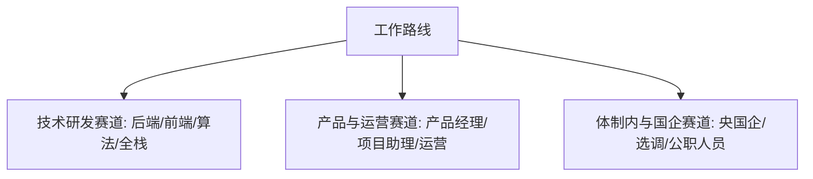

# 《大学四年模拟器》16_工作/校招路线详细规则 v2.0

> **模块职责**：4号——进阶路线与 AI-Lab 隐藏成长线  
> **对接模块**：1号（流程与简历收口）、2号（数值门槛与资源消耗）、3号（事件接入）  
> **版本**：v2.0 正式完整版

---

## 1. 路线定位与设计哲学

在《大学四年模拟器》中，工作路线并非单纯的“找个班上”，而是反映普通大学生在大学四年中如何从懵懂的职业认知、技能与作品积累，逐步走向残酷真实的校招竞争与职场分流。

* **核心矛盾**：日常课业/生活 vs 实习积累与大创项目 vs 考研/保研的机会成本。
* **资源依赖**：高作品集（`portfolio`）、硬技能（`skill`）、职场交付力（`delivery`）与行业声誉（`reputation`）。
* **驻留成本**：进入【进行中 (PRIMARY)】阶段后，每月固定扣除 **$5\text{ TU} + 55\text{ EP}$**（见 2号 `07` §8.1）。

---

## 2. 工作路线 46 个月生命周期与时间窗口

工作路线严格遵循 1号 标准状态机：`锁定` $\rightarrow$ `潜在` $\rightarrow$ `可选择` $\rightarrow$ `进行中` $\rightarrow$ `完成 / 放弃`。

```text
[大一 1~12月] ────────> [大二 13~24月] ────────> [大三 25~36月] ────────> [大四 37~46月]
   锁定/潜在认知            探索/日常实习             暑期实习/主线决策          秋招冲刺/春招补录/入职
```

| 时间区间 | 总月份 | 路线状态 | 允许发生的核心事件与行为 | 关键流转条件 |
| :--- | :---: | :---: | :--- | :--- |
| **大一上** (9-1月) | 1 ~ 5 | `锁定` | 职业通识讲座、专业行业认知、学长学姐经验分享。不开放主动求职。 | 默认锁定 |
| **大一下** (2-6月) | 6 ~ 10 | `潜在` | 认识到就业出口的存在，可在假期了解不同技术栈与岗位方向。 | 满足时间自动进入【潜在】 |
| **大二上** (9-1月) | 13 ~ 17 | `可选择` | **职业探索期**：可加入实验室、开源项目、大作业深度开发，积累初代作品集。 | 满足时间进入【可选择】 |
| **大二下** (2-6月) | 18 ~ 22 | `可选择` | **日常实习探索**：可尝试投递中小型企业日常实习或校内项目外包。 | `skill` $\ge 35$ 且 `portfolio` $\ge 20$ |
| **大三上** (9-1月) | 25 ~ 29 | `可选择` | **主路线确立窗口**：决定是否将工作设为主路线，开始系统准备作品集与简历。 | 玩家可自主确认设为【进行中】 |
| **大三下** (2-6月) | 30 ~ 34 | `进行中` | **暑期实习大战**：大厂暑期实习招聘（3-5月），争取转正名额（6月转正考核）。 | `portfolio` $\ge 50$ 且 `delivery` $\ge 45$ |
| **大四上** (9-1月) | 37 ~ 41 | `进行中` | **秋季校招巅峰 (9-11月)**：投递简历、参加笔面试、发放意向书（Offer）。 | 9-11月集中结算秋招结果 |
| **大四下** (2-6月) | 42 ~ 46 | `完成/分流` | **春招补录 (3-4月) / 毕业入职 (5-6月)**：三方协议签署、毕业设计、入职准备。 | 6月收口生成最终职业去向 |

---

## 3. 岗位赛道分类与能力模型要求

工作路线根据玩家四年的属性积累，细分为三大主流赛道：



### 3.1 技术研发赛道 (Tech R&D)
* **核心属性**：`skill` $\ge 65$、`portfolio` $\ge 60$、`delivery` $\ge 55$。
* **加分项**：`ai_depth`（AI-Lab 成果直接提供大厂研发免笔试或加分）、高星开源项目。
* **考核方式**：技术代码考核、算法手撕、系统设计与项目深挖。

### 3.2 产品与运营赛道 (Product & Operations)
* **核心属性**：`delivery` $\ge 65$、`social` $\ge 60$、`reputation` $\ge 55$。
* **加分项**：上线项目数据指标（`portfolio` 中包含商业化/运营数据）、学生会/大型活动主办经历。
* **考核方式**：群面（无领导小组讨论）、业务 Case 拆解、原型设计与沟通表达。

### 3.3 央国企与体制内赛道 (State-Owned & Civil Service)
* **核心属性**：`academic` $\ge 70$（看重绩点与课程排名）、`family` $\ge 60$（家庭提供信息与托底）、党员/学生干部标记。
* **加分项**：无挂科记录、国家奖学金/校级荣誉。
* **考核方式**：行测/申论笔试、结构化面试、政审与体检。

---

## 4. 求职全流程核心机制与判定算法

### 4.1 简历投递与筛选机制
* 引入路线局部计数变量 **`resume_sent`**（已投递简历数）与 **`interview_count`**（面试邀请数）。
* **面试邀请率公式**：
  $$\text{PassRate}_{resume} = \min\left(0.95, \frac{\text{portfolio} \times 0.4 + \text{skill} \times 0.3 + \text{reputation} \times 0.2 + \text{academic} \times 0.1}{80}\right)$$
* 达到 `portfolio` $\ge 70$ 且拥有 AI-Lab 高阶经历时，直接触发大厂绿色内推通道（免初筛）。

### 4.2 面试表现与 Offer 结算（大四上 9~12 月）
系统在秋招峰值月（大四上 9~11 月）对进行中的工作路线玩家执行 Offer 判定：

| Offer 等级 | 现实对应 | 判定条件表达式 | 最终结局映射 |
| :--- | :--- | :--- | :---: |
| **SSP / 顶尖大厂** | 年薪 35W+、核心研发/外企 | `portfolio` $\ge 75$ 且 `skill` $\ge 70$ 且 `delivery` $\ge 65$ 且 `reputation` $\ge 60$ 且 `flag_broken_promise == false` | **E04 / E05** |
| **SP / 优质名企** | 年薪 20-30W、中大厂/核心国企 | `portfolio` $\ge 55$ 且 `skill` $\ge 55$ 且 `delivery` $\ge 50$ 且 `academic` $\ge 50$ | **E06** |
| **白菜 / 常规录用** | 普通中小企业、常规岗位 | `portfolio` $\ge 35$ 且 `skill` $\ge 40$ 且 `delivery` $\ge 35$ 且 `academic` $\ge 45$ | **E07** |
| **秋招失利 (落选)** | 未拿到任何有效 Offer | 未能满足以上任何一档门槛 | 转入春招补录 |

---

## 5. 秋招失利与春招分流机制

如果玩家在大四上 12 月仍未获得任何有效 Offer：
1. **状态惩罚**：触发心理压力事件，精力上限 $EP_{max} - 10$，家庭压力上升（`family` 扣减 Tier 2）。
2. **春招补录通道 (大四下 3-4月)**：
   * 岗位数量仅为秋招的 $30\%$，HC 显著收紧；
   * 必须在 3 月前执行一次【紧急突击作品集 (Lv 3)】或【修改简历 (Lv 2)】以补齐短板；
   * 春招最高只能斩获 **SP 档（中型企业）** 或 **白菜档**，无法获得 SSP。
3. **彻底求职失败后的毕业收口**：
   * 若春招依然未能达标，毕业收口判定为 **E14 慢就业/求职失利** 或 **E13 考公/体制再战**。

---

## 6. 路线退出与机会成本

* 玩家可以在大三上或大三下主动选择【放弃工作主线】：
  * 路线状态置为 `EXITED`；
  * 免除每月 $5\text{ TU} + 55\text{ EP}$ 的驻留成本；
  * **已积累的 `portfolio`, `skill`, `delivery` 及实习经历条目（`ResumeEntry`）完全保留**，不予清除；
  * 释放出的时间与精力可全力转投考研或毕业设计。
