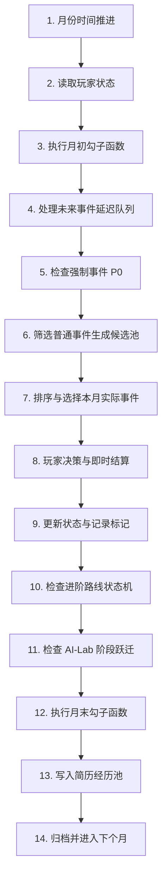

# 《大学四年模拟器》玩家状态架构与毕业简历收口系统 v2.0

> **模块职责**：1号——游戏流程与分支逻辑总控 / 毕业收口系统  
> **涵盖文档**：`01_月度游戏循环.md`、`02_玩家状态总结构.md`、`05_跨月事件与长期因果规则.md` (v1.1 收口系统)  
> **版本**：v2.0 正式完整版

---

# 第一篇 玩家状态总结构 Schema (PlayerState)

为了承载 2号 的 5 大基础状态与 7 大能力资产，以及 4号 的进阶路线与 3号 的简历经历池，系统定义统一的玩家全局数据结构：

```json
{
  "time": {
    "year": 1,              // 年级: 1, 2, 3, 4
    "semester": 1,          // 学期: 1 (上学期), 2 (下学期)
    "month": 9,             // 自然月: 1 ~ 12
    "total_month": 1        // 全局推进总月份: 1 ~ 46
  },
  "basic_states": {
    "academic": 55,         // 学业 [0, 100], 初始 50~60
    "social": 40,           // 社交 [0, 100], 初始 30~45
    "romance": 30,          // 恋爱 [0, 100], 非单调轴, 初始 25~35 (健康单身)
    "family": 55,           // 家庭 [0, 100], 经济与精神支持, 初始 50~60
    "health": 80            // 健康 [0, 100], 决定精力上限, 初始 75~85
  },
  "capability_assets": {
    "portfolio": 0,         // 作品集 [0, 100], 真实代码库、Demo、产品
    "research": 0,          // 科研 [0, 100], 学术训练、论文、组会
    "skill": 10,            // 硬技能 [0, 100], 编程、框架、工具实战
    "delivery": 20,         // 交付力 [0, 100], 不画饼、按时交差闭环
    "reputation": 30,       // 声誉口碑 [0, 100], 靠谱诚信不失约
    "focus": 50,            // 专注度 [0, 100], 深度工作抗干扰定力
    "ai_depth": 0           // AI深度 [0, 100], Agent/前沿大模型实战深度
  },
  "resources": {
    "TU_current": 10,       // 当前月可用自由时间单位 (默认 10 TU/月)
    "EP_current": 100,      // 当前精力储备
    "EP_max": 100,          // 精力上限: 60 + 0.5 * health
    "overdraft_EP": 0       // 透支精力 (次月初线性扣减并损伤健康)
  },
  "routes": {
    "work": {
      "status": "LOCKED",   // LOCKED / POTENTIAL / AVAILABLE / PRIMARY / EXITED / COMPLETED
      "resume_sent": 0,     // 投递简历计数
      "offer_grade": "NONE" // NONE / WHITE / SP / SSP
    },
    "postgrad_exam": {
      "status": "LOCKED",
      "exam_prep": 0        // 备考值 [0, 100]
    },
    "postgrad_rec": {
      "status": "LOCKED",
      "qualify_score": 0    // 保研推免综合分
    },
    "ailab": {
      "phase": "HIDDEN",    // HIDDEN / FORESHADOW / DISCOVERED / ACTIVE / CORE / EXITED
      "task_completed": 0   // 已完成任务卡计数
    }
  },
  "history": {
    "flags": {},            // 标记字典, 如 "FLAG_SO_MET_LIN": true
    "future_events": [],    // 延迟未来事件队列
    "completed_events": [], // 历史已完成事件ID列表
    "resume_pool": []       // 简历经历池: ResumeEntry 数组
  }
}
```

---

# 第二篇 月度 14 步标准循环与勾子函数执行流

每个月系统严格按以下 14 步标准流转执行：



### 1. 月初勾子函数 (Start-of-Month Hook) 顺序：
1. **计算 $EP_{max}$**：$$EP_{max} = 60 + \text{health} \times 0.5$$；
2. **应用健康行动封锁**（`07` §2.3）：若健康 $\le 20$，当月 TU 上限压制为 $3$，仅允许执行休整类 Lv R 行动；若健康 $\le 40$，禁用 Lv 3/Lv 4 高负荷行动；
3. **扣除路线驻留成本**（`07` §8.1）：扣除当前进行中路线的刚性 TU 与 EP；
4. **结算上月透支惩罚**：次月初精力扣减上月透支额，并造成健康损耗 $\lceil |\text{透支}|/3 \rceil$；
5. **家庭强制占用结算**：若家庭 $\le 20$，扣除 $2\text{ TU}$ 兼职；若家庭 $21\sim 40$，扣除 $1\text{ TU}$ 兼职。

### 2. 月末勾子函数 (End-of-Month Hook) 顺序：
1. **自然衰减检查**：
   * 学期末检查学业投入是否少于 2 次（未达标学业 $-5$）；
   * 连续 3 个月零社交（社交 $-3$）；
   * 核心技术资产连续 12 个月零实践（`skill`/`ai_depth` $-2$）。
2. **状态耦合结算**（`06` §4）：
   * 健康 $\le 20 \rightarrow$ 下月初传染扣减学业 $-10$、社交 $-10$；
   * 恋爱 $\le 20$（内耗） $\rightarrow$ 扣减精力 $-15$、专注度 $-20$。
3. **剩余 TU 结算与被动恢复**：未用完的 TU 结算为被动身心休息，健康微幅被动恢复（单月健康恢复总量上限 $+15$）。
4. **全局边界保护**：对所有状态强制执行 $\mathrm{clamp}(V, 0, 100)$ 兜底。

---

# 第三篇 毕业简历收口系统 (Resume System)

在第 46 个月（大四下 6 月）结束后，系统不再弹出简单的数值排行榜，而是提取玩家四年保存的全部经历，生成一份**属于该玩家的专属《大学毕业简历 (ResumeData)》**。

## 1. 简历数据结构 (ResumeData & ResumeEntry)

```json
{
  "resume_entry": {
    "source_event_id": "AI_002",
    "total_month": 32,
    "category": "PROJECT_EXP", // EDUCATION / ACADEMIC / CAMPUS_ACT / PROJECT_EXP / INTERNSHIP / RESEARCH / HONORS / SKILLS
    "chain_id": "EXP_AI_LAB_01",
    "stage_contribution": "CORE", // INTRO / PARTICIPANT / CORE / LEADER
    "title": "企业级生成式大模型 Agent 平台研发",
    "description": "主导完成多智能体协作框架重构，实现生产环境稳定交付，沉淀工业级交付规范。"
  }
}
```

---

## 2. 连续事件经历链合并算法

如果玩家在四年中多次参与同一项目（例如大二下接触、大三参与、大四负责），系统严禁在简历中逐月罗列碎片事件，必须使用 **经历链编号 (`chain_id`)** 进行合并：

```text
第 20 个月: 接触 AI-Lab 基础学习 (EXP_AI_LAB_01)
第 26 个月: 完成 AI-Lab 入组试做 (EXP_AI_LAB_01)   ───────>  【毕业简历项目经历合并为单一高质量条目】:
第 32 个月: 主导 Agent 平台交付 (EXP_AI_LAB_01)              "2027—2029 AI-Lab 核心开发者: 持续参与AI前沿项目研发，
第 40 个月: 负责极客挑战线攻坚 (EXP_AI_LAB_01)              从基础开发逐步主导企业级智能体平台交付，具备高阶工程能力。"
```

---

## 3. 五大生活状态与进阶路线向毕业简历的映射转换表

| 原系统数据源 | 转换规则与阈值条件 | 毕业简历对应栏目与呈现内容 |
| :--- | :--- | :--- |
| **学业 (Academic)** | `academic` $\ge 82$ (前10%) $\rightarrow$ 绩点卓越<br>`academic` $60\sim 81$ $\rightarrow$ 基础扎实 | **【教育背景】**<br>学业绩点排名（前 5% / 前 10% / 良好）、专业核心课优异表现。 |
| **社交 (Social)** | 产生过社团/组队标记，`social` $\ge 65$ | **【校园活动与组织经历】**<br>担任社团骨干、团队合作与跨组织协调经历。 |
| **恋爱与家庭** | 通常不作为独立简历条目 | **【四年回顾与人生总结】**<br>体现在“四年个人发展与心态回顾”篇章，避免强行简历化。 |
| **健康与体育** | 拥有长期运动标记，`health` $\ge 80$ | **【个人特质/校园经历】**<br>校级体育赛事、具备极强抗压与身心韧性。 |
| **工作路线** | 处于进行中且产生实习经历条目 | **【实习经历与商业项目】**<br>xx 公司日常实习生/暑期实习生，主导商业化需求闭环。 |
| **考研路线** | 初试通过且达到考研上岸标准 | **【毕业去向 / 荣誉成果】**<br>成功考取目标院校硕士研究生（升学深造）。 |
| **保研路线** | 9月获得推免资格并确认录取 | **【毕业去向 / 荣誉成果】**<br>推荐免试攻读硕士学位（清北华五/本校直博/学硕）。 |
| **AI-Lab** | 达到 `ACTIVE` 或 `CORE` 阶段 | **【重点项目经历】**<br>AI-Lab 实验室成员/核心开发者，主导大模型与前沿技术攻坚。 |
